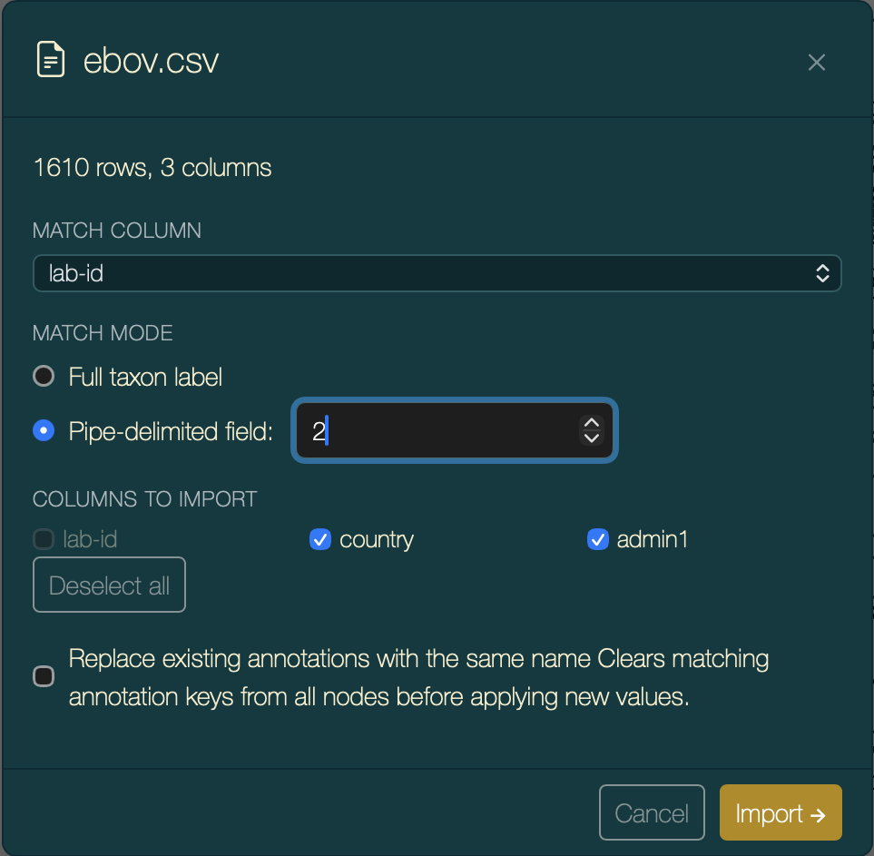
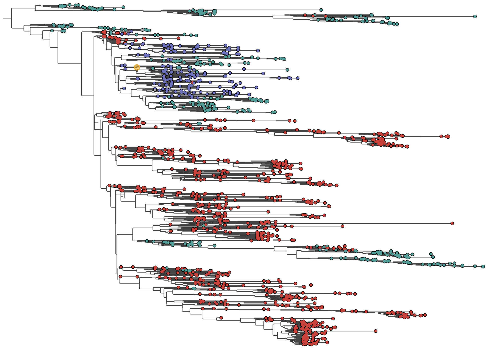
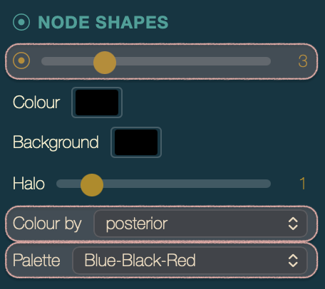
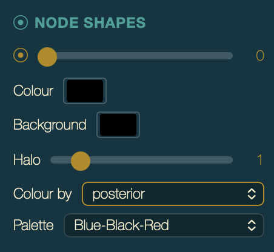
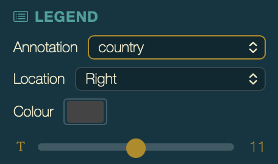

# PearTree Tutorial

This tutorial walks through the main features of PearTree using the built-in Ebola virus (EBOV) example dataset. To make this simple this uses the on-line web application at [http://artic-network.github.io/peartree](http://artic-network.github.io/peartree) but it will also work with the desktop apps available for Mac, Windows & Linux here: [https://github.com/artic-network/peartree/releases](https://github.com/artic-network/peartree/releases). 

No files need to be downloaded — everything runs locally in your browser using provided example files.

---

## 1. Opening the Example Dataset

When you first launch PearTree you will see the startup screen.

>  
> 
> Startup screen showing the "No tree loaded" and the **Open…** and **Example…** buttons.

Click **Example…** to load the built-in EBOV dataset immediately. 

Alternatively, click the open button  (or press **⌘O**) to open the *Open Tree File* dialog, switch to the **Example** tab, and click **Load Example Data**.

> 
>
> *Open Tree File* dialog with the `Example` tab selected.

> **Note** 
> In the installable, desktop, applications choosing the Open Tree command (either from the menu or the toolbar button) will go directly to openning a local file using the system's file chooser.

After a moment the tree will appear on the canvas.

There are two other ways of loading trees from this dialog box. From a file on your hard drive:

> 
>
> *Open Tree File* dialog with the `File` tab selected.

Note that the tree just gets imported into the web browser, not uploaded to a server - it remains on your computer.

Finally, you can point it towards a tree file on the internet by entering the URL:

> 
>
> *Open Tree File* dialog with the `URL` tab selected.

For this tutorial, just open the Example tree.

---

## 2. The Interface at a Glance

The interface has four main areas:

- **Toolbar** (top) — buttons for files, navigation, zoom, ordering, selection, rerooting, and panels
- **Canvas** (centre) — the tree drawing; fills the central space on the page
- **Visual Options palette** (left, hidden by default) — all display controls
- **Status bar** (bottom) — live readout of values under the cursor

> 
> 
> EBOV tree loaded and filling the canvas. Tip labels will not currently be visible because of the size of the tree. The colours used will be determined by the **theme** currently being used - the current default is the `ARTIC` theme but this can be changed. From this point on we will use `Minimal` --- a simple monochrome theme –-- for clarity.

---

## 3. Ordering Branches

Reordering the branches so that nodes with more tips are shown towards the bottm of the page (or top) can help better understand the relationships of the nodes. 

The **Order** buttons sort the clades by size:

| Button | Shortcut | Effect |
|---|---|---|
|  | ⌘U | Larger clades toward the top |
|  | ⌘D | Larger clades toward the bottom |

> [!NOTE]
> Once the tree has been ordered, the original order has been lost and you only have the choice of up or down orders or you can [rotate the nodes manually](#9-rotating-nodes-rotating-nodes).

>   
>
> EBOV tree with ascending order applied

---

## 4. Navigating the Tree

There are many ways of quickly navigating the tree which will be useful if the tree is very large.

### Scrolling and Zooming

Firstly you can zoom in and then scroll up and down. You can do this with the mouse/trackpad either using the mouse scroll wheel or a two-fingered drag on the trackpad. Holding the Shift key whilst using the scroll gesture will perform a zoom instead.

| Action | Effect |
|---|---|
| **Scroll** | Pan the tree vertically |
| **⇧ + Scroll** | Zoom in/out, anchored at the mouse position |
| **Pinch** (trackpad) | Zoom in/out |

Arrow keys allow a fine control over the scrolling amount:

- **↑ / ↓** — scroll one row at a time
- **⌘↑ / ⌘↓** — scroll one page at a time

You can also use the toolbar zoom buttons or keyboard shortcuts:

| Button | Shortcut | Action |
|---|---|---|
|| **⌘=** | Zoom in (×1.5) |
|| **⌘−** | Zoom out (×1.5) |
|| **⌘⇧0** | Fit Labels — zoom so no tip labels overlap |
|| **⌘0** | Fit the whole tree to the window |

Zoom in until individual tip names are readable or press the Fit Labels button or `⌘⇧0` to do this automatically. 

> 
>
> Tree zoomed in to show a small cluster of tips with readable labels.

Press the Fit all button or **⌘0** to return to the full view.

---

## 5. The Hyperbolic Lens

The hyperbolic lens lets you expand a region of the tree without zooming — the area near the cursor is stretched to label-readable spacing while the rest compresses but remains visible.

### Activating the Lens

Hold **~** (the backtick/tilde key) and move the cursor over the canvas. The tree distorts around the cursor's vertical position.

> 
>
> Lens active: tips near the cursor are spread apart and readable; tips further away are compressed.

The lens **persists** after you release ~ — the focus stays fixed so you can interact with the expanded region normally. Move with ~ held to reposition it.

Press **Escape** to dismiss the lens effect.

### Adjusting the Lens Width

The **Lens:** button pair in the toolbar (or **⌘⇧+** / **⌘⇧−**) controls the size of the uniformly-expanded centre zone:

- Each press of **⊕** adds one extra row of tip-spacing to the flat centre zone.
- Each press of **⊖** removes one row.
- At zero (default) the lens is a pure hyperbolic falloff from the focus point.

The peak magnification is always capped at the *Fit Labels* spacing level, so labels in the expanded zone never overlap.

---

## 6. Selecting Nodes and Tips

PearTree has two selection modes; **Nodes** mode is active by default.

### Nodes Mode

- **Click a tip** — selects that tip; the status bar shows its name and divergence.
- **Click an internal node** — selects all descendant tips; a teal ring marks the MRCA node.
- **⌘-click** — add to or remove from the current selection.
- **⌘A** — select all visible tips.
- **Click empty space** — clears the selection.

You can also click and drag to select all the tips within an area.

In the current view try clicking an internal node near the root of the visible tree.

> 
>
> Several tips selected (highlighted) and MRCA ring visible on an internal node.

### Branches Mode (⌘B)

Press **⌘B** (or click the branch-mode button) to switch to **Branches** mode. Click anywhere along a horizontal branch to place a precise positional marker.

Press **⌘B** again to return to **Nodes** mode.

> [!TIP]
> Branch selection mode is generally used to allow  re-rooting of a tree. However, as the example tree is a rooted, time-calibrated tree, re-rooting is disabled. See [Appendix](#appendix-rerooting-the-tree-rerooting) for information about re-rooting an unrooted tree.

---

## 7. Subtree Navigation

PearTree has some useful functions for 'drilling-down' into parts of the tree to view subtrees and clades and then easily return back to the previous view. 

**Double-click** any internal node to zoom into its subtree. Or select a node and press the `drill-down` button . The canvas re-renders showing only the descendants of that node.

> 
>
> 
>
> A sub-clade of the EBOV tree filling the full canvas after double-clicking.

PearTree stores a history of the parts of the tree you visit. **Double-click** on the root node of the subtree (or use the `back` button ) to go back to your previous view.

Use the **History** buttons in the toolbar (or **⌘[** / **⌘]**) to navigate back and forward through your drill-down history.

| Button | Shortcut | Effect |
|---|---|---|
|| `⌘⇧>` | Drill-down into the selected subtree |
|| `⌘[` | Go back through the drill-down history |
|| `⌘]` | Go forward through the drill-down history |
|| `⌘⇧<` | Climb up one node towords the root |

---

## 8. Rotating Nodes

By 'rotating' a node we mean putting the bottom branch at the top and the top branch at the bottom. This changes the visual layout of the tree but doesn't change the actual phylogeny or what it means. You can also rotate or flip an entire clade. Rotating a node will undo the 'Branch Ordering' [described above](#branch-ordering) and these buttons will become unselected. 

To rotate an internal node, select a node and then use the **Rotate** buttons:

| Button | Effect |
|---|---|
|  | Reverses the direct children of the selected node |
|  | Recursively reverses children at every level in the selected subtree |

> 
>
> 
>
> 
>
> Before and after rotating a branch: one branch (`EBOV|EM_COY_2015_017865||GIN|Dubreka|2015-06-18`) swaps position. In the bottom image, the entire clade has been 'rotated'.

---

## 9. Hiding and Showing Subtrees

Hiding removes a node and all of its descendants from the tree layout entirely — they simply disappear from the canvas and the remaining tree reflows to fill the space. This is useful for focusing on a subset of the tree without changing the underlying data.

### Hiding a Single Tip Branch

1. Select a tip node.
2. Click the **Hide** button (eye-slash icon) in the toolbar.

The selected tip is removed from the view and the visible tree rescales. The tip count shown elsewhere (e.g. in Node Info) reflects only the still-visible tips.

> 
>
> 
>
> A section of the tree before and after hiding a selected tip (`EBOV|CON12930||GIN|Conakry|2015-10-13`).

### Hiding a Subtree

1. Select an internal node (its descendant tips will be highlighted).
2. Click the **Hide** button (eye-slash icon) in the toolbar.

The selected node and all its descendants are hidden in the tree and removed from the view. 

> 
>
> 
>
> A section of the tree with a node and its descendents selected and after this node has been hidden.

### Showing Hidden Nodes

To restore hidden nodes:

If there are any hidden nodes within the currently viewed part of the tree (or if a clade has been selected, amongst those nodes) then the **Unhide** () button will be available.

- **With a node selected** — select the parent node (the branch stub where the hidden subtree was attached) and click  (**Unhide** ). The hidden descendants of that node are restored.
- **With nothing selected** — click  (**Show** ) with no selection to reveal *all* hidden nodes in the current view at once.

> **Note:** Hiding changes the visible tip count, so any active branch ordering (ascending/descending) is automatically cleared when you hide or show nodes.

---

## 10. Node Info (⌘I)

Select any node or tip, then press **⌘I** or click the  button. A dialog lists every annotation on that node — name, divergence, branch length, any posterior support values, or any custom annotations you have imported.

> 
>
> Node Info dialog showing the selected tip's name, divergence, and annotation fields.

---

## 11. Importing Annotations

The EBOV example has some annotations embedded in the tree file. These were put there by BEAST during the construction of the tree. To add extra per-tip metadata from your own CSV or TSV:

- Click the  button (or press **⌘⇧A**).

- Drag a CSV/TSV onto the drop zone or click *Choose File*. Or for this tutorial,you can select *URL* and then paste the following URL into the box:
```https://artic-network.github.io/peartree/docs/data/ebov.csv```

  > 
  >
  > Import Annotations dialog.

> **Note**: This dialog box will only appear if running PearTree on a web server - for the desktop app, a native file chooser will appear for you to select the file. If you want to do this step, download the file from the URL below and then select it in the file chooser.

- A dialog box will appear which will allow you to specify how the annotation file will be used. Select which column in the metadata file is going to be used to match the tip labels in the tree. By default PearTree will try to match the entire tip label but if the labels are made up of 'fields' separated by the `|` (pipe) character then you can choose which is the field to match. For the example data it is the `lab-id` in the second field.

  > 
  >
  > Import configuration dialog showing column checkboxes and preview rows.

- Click **Import**. A summary reports how many tips matched.

  > 
  >
  > Import summary dialog box. This confirms that all 1610 tips of the tree were matched with a row in the metadata file annotated with the required columns.

After import the new annotation keys appear in all *Colour by* dropdowns and the *Legend* selector. They will also appear in the *Get Info* dialog box for selected tips.

---

## 12. Colouring the Tree by Annotation

Open the **Visual Options palette** (press **Tab** or click the sliders button).

### Colouring Tip Shapes by Annotation

Under **Tip Shapes**, change **Colour by** from *user colour* to an annotation key (e.g. `country` if present in the EBOV tree).

> 
>
> The controls for setting the tip shape styles with **Colour by** set to `country`.

The result will be that the dots on the tips of the will be given a distinct colour depending on the unique country designation.

> 
>
> Tip shapes coloured by the `location` annotation; each unique value has a distinct colour.

Try changing the `Palette` to give alternative colour schemes.

### Colouring Tip Labels by Annotation

You can also have the tip labels coloured by an annotation (the same as the tip shapes or something different)

Under **Tip Labels**, change **Colour by** to the `country`. The tip labels now match the colours of their shapes.

### Colouring Internal Nodes

Internal node's can also have circles which can be coloured by annotation values. By default these may not be visible so under the **Node Shapes** section of the Tool Drawer, increase the size to change **Colour by** to `posterior`. Internal nodes will only have annotations if they were encoded in the tree -- in this tree Bayesian posterior support values have been supplied using the label `posterior`.

> 
>
> The controls for setting the node shape styles with **Colour by** set to `posterior` and **Palette** set to `Blue-Black-Red`. The size has also been increased to `3` to make the shapes visible. 

The `posterior` annotation is a real number between 0 and 1 so will be given a gradient of colours across its possible values. There is a selection of colour palettes to chose from but with these types of support values -- support values such as posterior or bootstrap values -- a three colour palette such as `Blue-Black-Red` will work best because it means that red colours are >0.5 and blue colours are <0.5. 

> 
>
> Node shapes coloured by the `posterior` annotation. Tip shapes have been hidden for clarity. The more red the colour, the closer the value is to 1.0 (high support) and the more blue, the closer the value is to 0.0 (low support).

---

## 13. Adding a Legend

For a selected annotation used to colour some feature of the tree, you can also display a legend to provide a scale or key for what the colours mean.

In the **Visual Options palette**, scroll to the **Legend** section:

1. Set **Show** to *Left* or *Right* -- which side of the screen you want it.
2. Set **Annotation** to the key whose colour scale you want to display.

The legend that is display will depend on whether the annotation is a real number or categorical.

> 
>
> EBOV tree with tips coloured by `country` and a legend on the right providing a key linking the colours to the countries.

---

## 14. Applying a User Colour

You can also manually colour tips with individual colours. First pick a colour using the colour picker in the main tool bar:

> 

Then select one or more tips. You can do this by clicking on them or using the filter box to select tips with a particular string in their tip labels.

3. Click the **Apply** button  —- the selected tips are then marked with that colour.

> 
>
> Tips dated from July to September 2015 highlighted in bright orange.

User colours are stored as a `user_colour` annotation and can be used in the *Colour by* dropdowns like any other annotation. They can also be stored in exported trees when saved in NEXUS format.

To remove all user colours, click the **Clear**  button next to the swatch. This will remove all user colours from the selected tips or if none are selected from the displayed tree.

---

## 15. The Axis

The **Axis** section of the Visual Options palette adds a scale bar along the bottom of the canvas. It has four modes selected from the **Show** dropdown:

| Value | Axis type |
|---|---|
| **Off** | No axis drawn |
| **Forward** | Divergence from root (0 at root, increasing toward tips) |
| **Reverse** | Distance from the most-divergent tip (0 at rightmost tip, increasing toward root) |
| **Time** | Calendar-date axis (requires a date calibration — see below) |

### Divergence axes (Forward / Reverse)

Select **Forward** or **Reverse** to immediately draw a plain numeric scale. Use these with any tree where branch lengths represent substitutions-per-site or similar units. **Forward** is the conventional divergence axis; **Reverse** counts from the tips backwards toward the root, which can be convenient for emphasising recency.

### Time-calibrated axis

To draw a calendar-date axis you first need to tell PearTree which tip annotation holds sampling dates. This is done in the **Tree** section of the palette — *above* the Axis section.

#### Step 1 — Calibrate

In the **Tree** section, a **Calibrate** dropdown appears whenever the loaded tree has at least one annotation that PearTree recognises as a date (annotation type `date`, e.g. `collection_date` or `date`). Select that annotation key from the dropdown.

Once a calibration annotation is chosen, a **Format** row appears immediately below it:

| Format code | Example output |
|---|---|
| `yyyy-MM-dd` | `1977-05-04` |
| `yyyy-MMM-dd` | `1977-May-04` |
| `dd MMM yyyy` | `04 May 1977` |
| `dd MMMM yyyy` | `04 May 1977` (full month name — `04 March 1977`) |
| `MMM dd, yyyy` | `May 04, 1977` |
| `MMMM dd, yyyy` | `May 04, 1977` (full month name — `March 04, 1977`) |
| `MMM-dd-yyyy` | `May-04-1977` |

The chosen format applies to all **Full** and **Partial** tick labels on the axis (see below).

#### Step 2 — Switch the axis to Time

In the **Axis** section set **Show** to `Time`. The axis now displays calendar dates derived from the calibration.

#### Step 3 — Tick intervals

With **Show** set to *Time* and a calibration active, three additional rows become visible:

| Control | Options | Notes |
|---|---|---|
| **Major ticks** | Auto / Decades / Years / Quarters / Months / Weeks / Days | *Auto* picks the interval that gives roughly 5–8 ticks across the current view |
| **Minor ticks** | Off / (subset of intervals finer than the major interval) | Weeks are only offered as minor ticks when major = Years |
| **Major labels** | Partial / Full / Component / Off | See label modes below |
| **Minor labels** | Off / Component / Partial / Full | Off by default to keep the axis uncluttered |

#### Label modes

| Mode | Behaviour |
|---|---|
| **Full** | The complete date in the chosen Format, e.g. `2014-09-12` |
| **Partial** | Strips the sub-interval parts — a *Years* tick shows `2014`; a *Months* tick shows `2014-09`; a *Days* tick shows the full format |
| **Component** | Only the interval-specific part — Years: `2014`; Quarters: `Q3`; Months: `Sep`; Weeks: `W37`; Days: `12` |
| **Off** | No label drawn for ticks of this size |

For **Weeks** ticks specifically: *Component* shows the week number as `W01`–`W53`; *Full* and *Partial* both show `2014-W37`.

> 
>
> EBOV tree with a time axis along the bottom. Axis set to *Time*, major ticks = *Years*, major labels = *Partial* (showing only the year).

---

## 16. Themes and Visual Customisation

The **Theme** section at the top of the Visual Options palette provides quick preset starting points.

Changing any individual control (background, branch colour, font size, etc.) switches the selector to *Custom*. Click **Store** to save a named personal theme.

  > 
  >
  > Visual Options palette open on the Theme section with the *MCM* theme applied.

## 17. Exporting the Tree

Click the **↓ file** button (or press **⌘S**) to save the tree.

- **Format** — *NEXUS* (supports annotations and embedded settings) or *Newick* (plain, portable)
- **Scope** — *Entire tree* or *Current subtree view*
- **Annotations** — checkboxes to include or exclude each annotation key
- **Embed settings** (NEXUS only) — ticking this embeds all current visual settings in the file so the appearance is restored automatically when the file is reopened

> 
>
> Export Tree dialog.

---

## 18. Exporting a Graphic

Click the **image** button (or press **⌘E**) to download an image.

| Setting | Options |
|---|---|
| **Format** | **SVG** (vector, infinitely scalable) or **PNG** (raster at 2× resolution) |
| **View** | **Current view** (the visible portion) or **Full tree** (the complete height) |

SVG exports include branches, labels, shapes, legend strips, and the time axis as true vectors — ideal for publication figures.

> 
>
> Export Graphic dialog.

---

## 19. Settings Persistence

PearTree automatically saves all visual settings to browser **localStorage** and restores them on your next visit. This includes theme, palette values, colour-by choices, legend, axis configuration, branch order, and selection mode.

When you export a NEXUS file with **Embed settings** ticked, those settings travel with the file. Opening that file in PearTree restores the full appearance automatically.

---

## Quick-Reference: Keyboard Shortcuts

| Shortcut | Action |
|---|---|
| **⌘O** | Open file picker |
| **⌘⇧O** | Open Tree dialog |
| **⌘⇧A** | Import annotations |
| **⌘S** | Export tree |
| **⌘E** | Export graphic |
| **Tab** | Toggle Visual Options palette |
| **⌘=** / **⌘+** | Zoom in |
| **⌘−** | Zoom out |
| **⌘0** | Fit all |
| **⌘⇧0** | Fit labels |
| **⌘A** | Select all tips |
| **⌘B** | Toggle Nodes / Branches mode |
| **⌘D** | Order ascending |
| **⌘U** | Order descending |
| **⌘M** | Midpoint root |
| **⌘I** | Node info |
| **⌘[** | Navigate back |
| **⌘]** | Navigate forward |
| **~** (hold) | Activate hyperbolic lens at cursor |
| **⌘⇧+** | Expand lens area |
| **⌘⇧−** | Contract lens area |
| **Escape** | Dismiss lens / close dialog / clear selection |

> On Windows and Linux replace **⌘** with **Ctrl**.

## Key Palette Controls

**Theme**


| Control | What it does |
|---|---|
| Theme selector | Choose a built-in or saved preset |
| **Store** | Save the current settings as a named personal theme |
| **Default** | Make the selected theme the default for new windows |
| **Remove** | Delete a user-saved theme |
| Typeface | Font family used for all labels |

**Tree**


| Control | What it does |
|---|---|
| Calibrate | Annotation key holding calendar dates used to calibrate a time axis; only shown when the tree has date-typed annotations |
| Format | Display format for calibrated-axis labels: `1977-05-04` (ISO), `1977-May-04` (abbreviated month), or `04 May 1977` (day-first); only shown once a calibration is active |
| Background | Canvas background colour |
| Branches | Branch line colour |
| Branch width | Stroke thickness (0.5–8 px) |
| Neg. branches | Whether negative branch lengths are drawn as-is or clamped to zero |

**Tip Labels**


| Control | What it does |
|---|---|
| Layout | *Normal* (labels float at each tip) or *Aligned* (labels right-aligned with optional leader lines) |
| Size | Font size (1–20 pt) |
| Colour | Default label colour |
| Colour by | Colour labels by an annotation key instead of the fixed colour |
| Palette | Colour palette to use when *Colour by* is active |
| Selected style | Text style applied to selected tip labels: Bold, Italic, Bold+Italic, or Normal |

**Tip Shapes**


| Control | What it does |
|---|---|
| Size | Tip circle radius (0 = hidden) |
| Colour | Tip shape stroke/fill colour |
| Background | Background fill behind each tip circle |
| Halo | Halo ring radius around each tip (0 = hidden) |
| Colour by | Colour tips by an annotation key |
| Palette | Colour palette to use when *Colour by* is active |

**Node Shapes**



| Control | What it does |
|---|---|
| Size | Internal-node circle radius (0 = hidden) |
| Colour | Node shape stroke/fill colour |
| Background | Background fill behind each node circle |
| Halo | Halo ring radius around each node (0 = hidden) |
| Colour by | Colour nodes by an annotation key |
| Palette | Colour palette to use when *Colour by* is active |

**Node Bars** *(only available for BEAST trees with height HPD intervals)*

| Control | What it does |
|---|---|
| Show | Toggle HPD bars on/off |
| Colour | Bar colour |
| Bar height | Vertical thickness of each bar in screen pixels |
| Line | Draw a central line at the *Mean*, *Median*, or neither |
| Range whiskers | Show or hide the outer extent whiskers |

**Legend**



| Control | What it does |
|---|---|
| Annotation | Which annotation's colour scale to display |
| Location | *Left* or *Right* side of the canvas |
| Colour | Legend text colour |
| Font size | Legend font size (6–16 pt) |

**Axis**


| Control | What it does |
|---|---|
| Show | *Off* — no axis; *Forward* — divergence from root; *Reverse* — distance from tips toward root; *Time* — calendar-date axis (requires calibration in Tree section) |
| Colour | Axis line, tick, and label colour |
| Font size | Tick-label font size (6–16 pt) |
| Line width | Axis line stroke thickness |
| Major ticks | Tick interval when in *Time* mode: Auto, Decades, Years, Quarters, Months, Weeks, or Days |
| Minor ticks | Finer tick interval between major ticks (or Off); available options depend on the major interval chosen |
| Major labels | Label mode for major ticks: *Partial* (strips sub-interval parts), *Full* (complete date in chosen Format), *Component* (interval-specific part only), or *Off* |
| Minor labels | Label mode for minor ticks: *Off*, *Component*, *Partial*, or *Full* |

Click **Reset to defaults** at the bottom of the palette to restore the *Artic* theme.

---

## Appendix: Rerooting the Tree

Re-rooting of trees is not possible for trees that are explicitly rooted (generally determined by whether they have annotations for the root node). This will be the case for time calibrated trees from BEAST, for example. If the tree is not explicitly rooted then some options for changing the root position will be available.

### Midpoint Root (⌘M)

Press **⌘M** (or click **Midpoint** in the toolbar) to automatically root the tree at the midpoint of its longest path. This is a common starting point for exploratory analysis.

<!-- > ** SCREENSHOT PLACEHOLDER** — EBOV tree after midpoint rerooting; root is repositioned. -->

### Rerooting at a Selection

1. Select a tip or a group of tips (their MRCA defines the branch).
2. Click the **Reroot** button — the root is placed at the midpoint of the branch above the MRCA.

### Rerooting at an Exact Branch Position

1. Press **⌘B** to enter **Branches** mode.
2. Click precisely where you want the new root on any branch.
3. Click **Reroot**.

<!-- > ** SCREENSHOT PLACEHOLDER** — Branch mode with marker placed near the base of a clade; tree after rerooting at that position. -->


---

## Appendix: Bootstrap Values, Branch Annotations, and Rerooting

### Node labels vs. branch labels

In a phylogenetic tree, every internal node can carry two conceptually different kinds of annotation:

- **Node annotations** — properties of the *node itself*, such as a Bayesian posterior probability for the clade defined by that node, or the inferred height of that node in time. These belong to the node regardless of where the root sits.
- **Branch annotations** — properties of the *branch leading to the node from its parent*, such as a bootstrap support value or a maximum-likelihood branch support. These belong to the branch, not the node.

The distinction matters when you reroot the tree. If you reroot on a branch that currently separates node A from the rest of the tree, that branch is split into two new branches and the old root disappears. Node annotations stay with their node unchanged. Branch annotations, however, are "carried" on a specific branch — they need to travel with it.

### Bootstrap values in Newick and NEXUS files

Bootstrap support values are typically written as the *internal node label* in Newick format:

```
((A:0.1,B:0.1)95:0.01,(C:0.1,(D:0.1,E:0.1)72:0.2)80:0.3);
```

Here `95`, `72`, and `80` are bootstrap values, `:0.1` etc. are the branch lengths. They are stored *at* the internal node but they actually describe the branch *leading from* that node to its parent. PearTree automatically recognises annotation keys named `bootstrap`, `support`, `label`, `posterior`, `posterior_probability`, `prob`, and `probability` as branch annotations, and sets the **Branch annotation** flag on them when the tree is first loaded.

### The "Branch annotation" flag

Every annotation key has a **Branch annotation** checkbox in the *Annotation Curator* (open the curator from the Import Annotations dialog or from Get Info). When this flag is ticked, PearTree knows to treat that key's values as belonging to branches rather than nodes.

You can inspect and change the flag at any time:

1. Load a tree that has bootstrap labels (a plain Newick file or a NEXUS file with bootstrap values).
2. Open **Get Info** (**⌘I**) on any internal node — you will see the bootstrap value listed under its key name.
3. Open the Annotation Curator for that key. The **Branch annotation** checkbox will already be ticked for known keys such as `bootstrap`.

If you have a custom annotation that behaves like a branch support (e.g. an IQ-TREE `UFBoot` value stored under a non-standard key), you can tick this box manually.

### How branch annotations move when you reroot

When you place the root on a new branch, every internal node in the tree gains a new parent. The affected branches are those along the path from the old root down to the newly chosen root position. PearTree updates branch annotation values along that path so they remain faithful to the branch they describe:

- Each node along the path *receives* the bootstrap value that was previously on the branch above it (i.e. the branch toward the old root), because after rerooting that is the branch that leads into that node from its new parent.
- The node that was the old root adjacent node, whose branch is now split to form the two new root branches, loses its value — there is no meaningful bootstrap for the newly created edge at the root (it is an artefact of rooting, not a clade tested during tree inference).
- All nodes *not* on the path between old and new root are unaffected.

### Notes

- **Rerooting a maximum-likelihood tree** that has bootstrap values works correctly in PearTree — bootstrap values track their branches faithfully after each reroot.
- **Multiple sequential reroots** are also handled correctly; each reroot updates only the path affected.
- **BEAST trees** store posterior support as a node annotation (not a branch annotation) alongside node heights. Re-rooting is disabled for explicitly-rooted BEAST trees, so this does not apply.
- Hiding nodes and branches does not change the branch annotations (and they will still be there when the branches are unhidden). But note that bootstap or other support values may not be appropriate if some nodes adjacent to that value have been hidden. 

---
