<p align="center">
  
</p>

# PearTree Manual

PearTree is a phylogenetic tree viewer that runs entirely in the browser or as a desktop application. No data is ever uploaded to any server — all processing is local to your machine.

This manual covers the full feature set of PearTree, organised by topic. Each chapter can be read independently. The [Quick-Reference](#appendix-a-keyboard-shortcuts) appendix at the end lists all keyboard shortcuts.

> **Where to get PearTree**
>
> - **Web application:** [https://peartree.live](https://peartree.live) (Chrome, Firefox, Safari, Edge)
> - **Desktop app:** [https://github.com/artic-network/peartree/releases](https://github.com/artic-network/peartree/releases) (macOS, Windows, Linux)
>
> All features described in this manual work in both versions unless noted.

---

## Contents

1. [The Interface at a Glance](#chapter-1-the-interface-at-a-glance)
2. [Loading Trees](#chapter-2-loading-trees)
3. [Importing Annotations](#chapter-3-importing-annotations)
4. [Navigating the Tree](#chapter-4-navigating-the-tree)
5. [The Hyperbolic Lens](#chapter-5-the-hyperbolic-lens)
6. [Organising the Tree](#chapter-6-organising-the-tree)
7. [Selecting and Filtering](#chapter-7-selecting-and-filtering)
8. [Decorating the Tree](#chapter-8-decorating-the-tree)
9. [The Time Axis](#chapter-9-the-time-axis)
10. [Rooting](#chapter-10-rooting)
11. [The Root-to-Tip Panel](#chapter-11-the-root-to-tip-panel)
12. [The Data Table Panel](#chapter-12-the-data-table-panel)
13. [Exporting](#chapter-13-exporting)
14. [Settings and Persistence](#chapter-14-settings-and-persistence)
15. [Appendix A: Keyboard Shortcuts](#appendix-a-keyboard-shortcuts)
16. [Appendix B: Visual Options Reference](#appendix-b-visual-options-reference)
17. [Appendix C: Bootstrap Values and Branch Annotations](#appendix-c-bootstrap-values-branch-annotations-and-rerooting)
18. [Appendix D: URL Parameters and Sharing](#appendix-d-url-parameters-and-sharing)

---

## Chapter 1: The Interface at a Glance

When a tree is loaded the interface has four main areas:

> 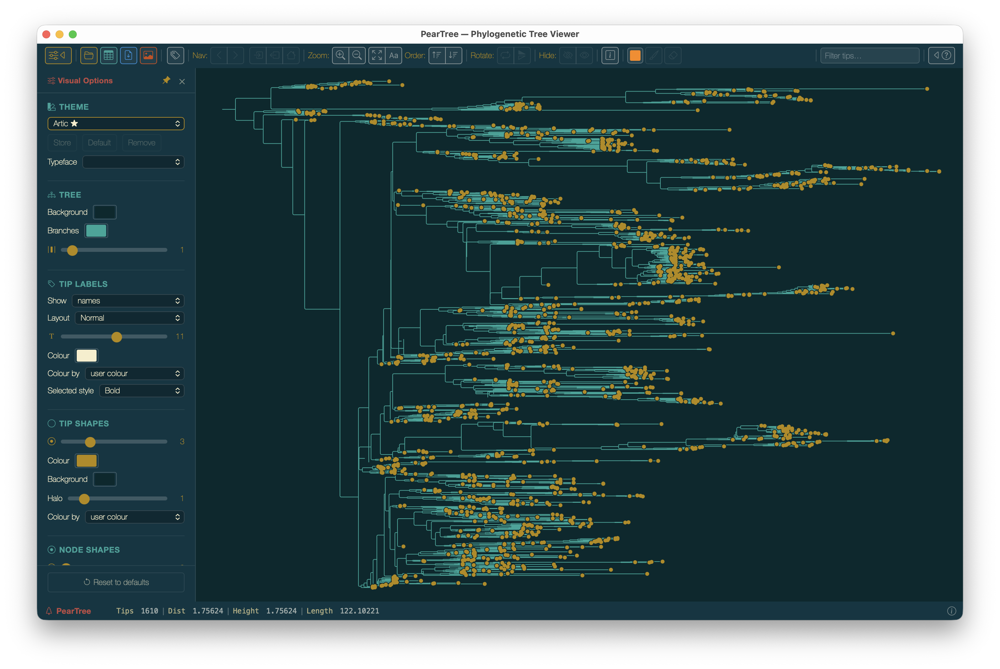
>
> EBOV example tree loaded. The toolbar runs along the top, the canvas fills the centre, and the status bar sits at the bottom. The Visual Options palette is shown toggled open on the right. Other panels such as the metadata table and temporal signal (root-to-tip) plot open on the right.

### Toolbar

Runs along the top of the window. Contains buttons grouped by function:

| Group | What it contains |
|---|---|
| **Visual Options** | Toggle the Visual Options palette (also **Tab**) |
| **File** | Open tree, import annotations, export tree, export graphic |
| **Annotations** | Annotation curator |
| **Info** | Node info (**⌘I**) |
| **Navigation** | Back, forward, drill into subtree, climb up one level, home |
| **Zoom** | Zoom in, zoom out, fit all, fit labels |
| **Order** | Sort clades ascending / descending |
| **Rotate** | Rotate selected node, rotate entire subtree |
| **Rooting** | Node / branch mode toggle; reroot, midpoint root, global temporal root, local temporal root |
| **Hide / Show** | Hide selected subtree, unhide |
| **Collapse** | Collapse clade to triangle, expand triangle |
| **Colour** | Colour picker swatch, apply colour, clear user colours, highlight clade, clear highlights |
| **Filter** | Tip filter text box with regex toggle and column selector |
| **Panels** | Data table panel toggle, root-to-tip panel toggle |

### Visual Options Palette

Slides in from the right. Toggle with the sliders button in the status bar or press **Tab**. Contains all display controls organised into collapsible sections. Sections are locked until a tree is loaded, then unlock automatically.

### Status Bar

Runs along the bottom. Shows live annotation values for the tip or node under the cursor. Also displays mode messages such as *Lens mode active – press Esc to cancel*.

### Canvas

The tree drawing fills all available space between the toolbar and status bar. Zoom and scroll with the mouse or trackpad. The tip labels are not shown unless zoomed to a level that they don't overlap.

---

## Chapter 2: Loading Trees

### Supported Formats

PearTree reads **NEXUS** (`.nex`, `.nexus`, `.tre`, `.tree`, `.treefile`) and **Newick** (`.nwk`, `.newick`) files. Tree data stored in NEXUS metacomments (e.g. BEAST output) is fully supported.

### Opening a File

Click the **open** button  in the toolbar, or press **⌘O**, to open the *Open Tree File* dialog.

Three tabs are available:

**File tab** — drag a file onto the drop zone or click *Choose file* to browse.

> 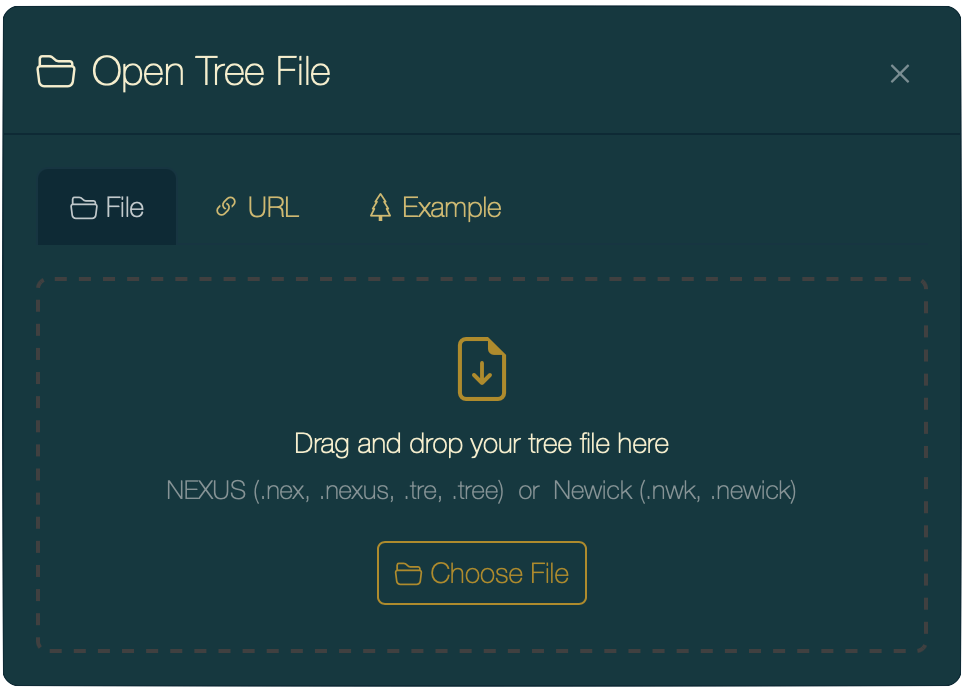
>
> *Open Tree File* dialog, File tab. The file stays on your computer — nothing is uploaded.

> **Desktop app note:** In the desktop application, **⌘O** opens the system file chooser directly rather than this dialog.

**URL tab** — paste a public URL to a remote tree file and click *Load from URL*. The remote server must allow cross-origin requests (CORS). GitHub raw URLs (`raw.githubusercontent.com/…`) work out of the box.

> 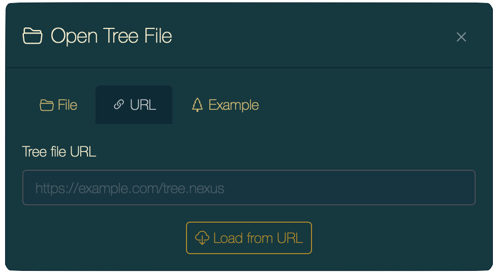
>
> *Open Tree File* dialog, URL tab.

**Example tab** — choose from a set of built-in example datasets:

| Dataset | Description |
|---|---|
| **Ebola virus (EBOV)** | Phylogenetic tree from the 2014–2016 West Africa epidemic — used throughout the examples in this manual |
| **SARS-CoV-2 (15K)** | Large SARS-CoV-2 tree with ~15,000 sequences — useful for testing performance with big trees |
| **Variola virus (VARV)** | Smallpox virus (variola) phylogeny |

Click a dataset card to load it immediately.

> 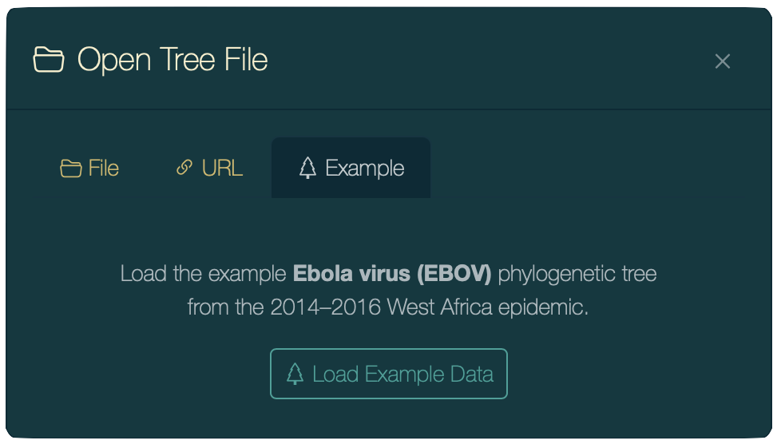
>
> *Open Tree File* dialog, Example tab.

### The Startup Screen

When no tree is loaded, the canvas shows the startup screen with direct **Open…** and **Example…** buttons.

> 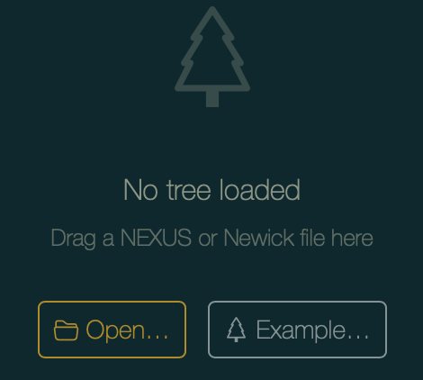
>
> Startup screen.

> [!TIP]
> You can share a link that opens a remote tree automatically. Append `?treeUrl=<URL>` to the PearTree web address — anyone who follows the link has the tree loaded immediately with no upload required. See [Appendix D](#appendix-d-url-parameters-and-sharing) for details.

### Opening a NEXUS File with Embedded Settings

If a NEXUS file was exported from PearTree with **Embed settings** ticked (see [Chapter 13](#chapter-13-exporting)), opening it restores the full visual appearance automatically — theme, palette choices, colouring, legends, and axis configuration.

---

## Chapter 3: Importing Annotations

Tree files embed per-tip metadata written by the inference tool (e.g. BEAST posterior values, HPD intervals). You can also add your own metadata from an external table at any time.

### Importing a CSV or TSV File

Click the annotation-import button  in the toolbar or press **⌘⇧A**.

> 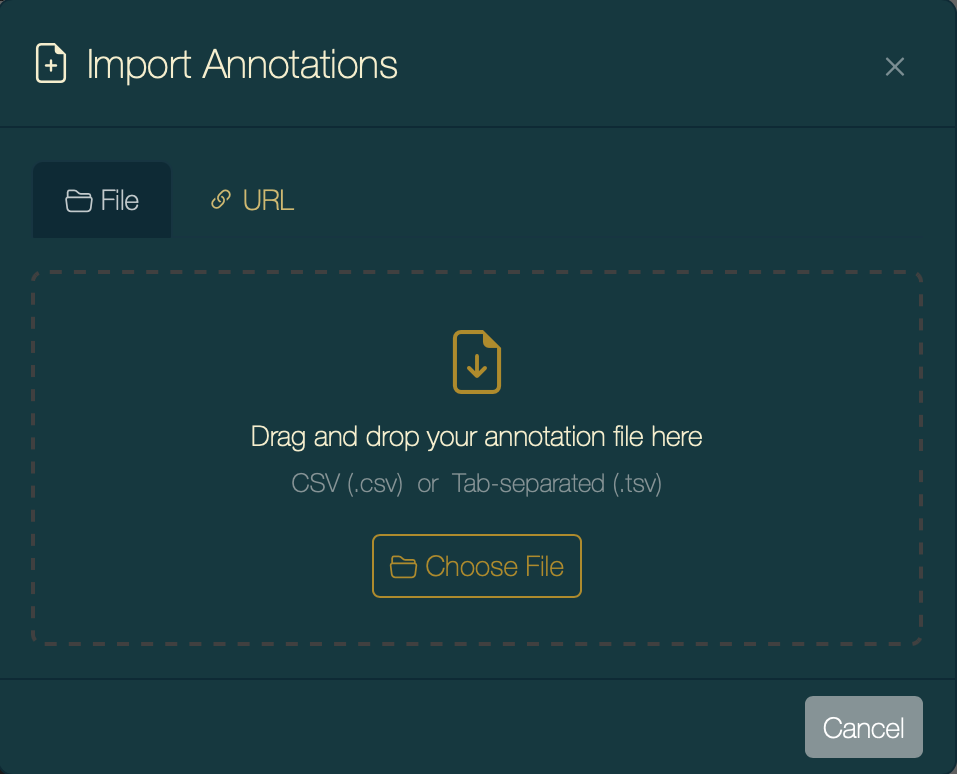
>
> Import Annotations dialog.

Drag a CSV or TSV file onto the drop zone, or click *Choose file* to browse. In the web app you can also switch to the *URL* tab and paste a public URL directly — for example the EBOV annotation file used in this manual:

```
https://artic-network.github.io/peartree/docs/data/ebov.csv
```

> **Desktop app note:** A system file chooser appears instead of the URL tab. The EBOV annotation file can be downloaded from the URL above and then selected in the file chooser.

#### Match Configuration

After selecting the file a configuration step appears. Choose which column in the metadata file identifies each tip:

> 
>
> Import configuration: choose the column that matches tip labels, and toggle which columns to import.

PearTree can match the entire tip label string, or just one pipe-delimited (`|`) field within it. For the EBOV example, select field 2 (`lab-id`) to match the second segment of each label.

#### Import Summary

After clicking **Import**, a summary reports how many tips were matched.

> 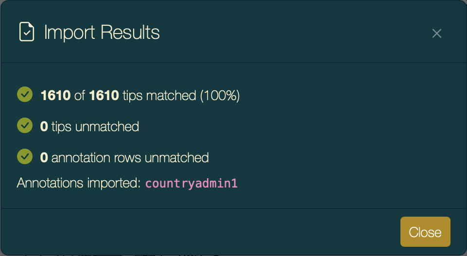
>
> Import summary confirming all 1610 tips matched.

After import the new annotation keys appear in all *Colour by* dropdowns, the legend selector, and the Node Info dialog.

### The Annotation Curator

Open the Annotation Curator from the toolbar (tags button) to review every annotation key currently loaded.

For each key you can:

| Action | Description |
|---|---|
| **Rename** | Give a key a more readable display label |
| **Change type** | Switch between *categorical* and *real* (continuous numeric) |
| **Branch annotation** | Mark a key as belonging to branches rather than nodes — affects how values move when rerooting (see [Appendix C](#appendix-c-bootstrap-values-branch-annotations-and-rerooting)) |

> [!TIP]
> If your tree uses a non-standard name for bootstrap values (e.g. `UFBoot` from IQ-TREE), open the Curator and tick **Branch annotation** for that key so PearTree handles it correctly when rerooting.

---

## Chapter 4: Navigating the Tree

*The examples in this chapter use the EBOV example tree (1610 tips). For navigation in very large trees, try loading `data/SARS-CoV-2_15K.tree` (15,000 tips).*

### Scrolling and Zooming

| Gesture / key | Effect |
|---|---|
| **Scroll wheel** / two-finger drag | Pan vertically |
| **⇧ + scroll** | Zoom in/out, anchored at the cursor position |
| **Pinch** (trackpad) | Zoom in/out |
| **↑ / ↓** | Scroll one row |
| **⌘↑ / ⌘↓** | Scroll one page |
| **⌘⇧↑ / ⌘⇧↓** | Jump to the top or bottom of the tree |

Toolbar zoom buttons:

| Button | Shortcut | Action |
|---|---|---|
|  | **⌘=** | Zoom in ×1.5 |
|  | **⌘−** | Zoom out ×1.5 |
|  | **⌘0** | Fit entire tree to window |
|  | **⌘⇧0** | Fit Labels — zoom so no tip labels overlap |

> **Automatic horizontal scaling:** When zoomed out so far that tip labels are hidden, PearTree expands the tree branches to fill the full canvas width. When you zoom back in enough for labels to become readable, the horizontal scale contracts to make room for them again. This maximises screen use at every zoom level.

> 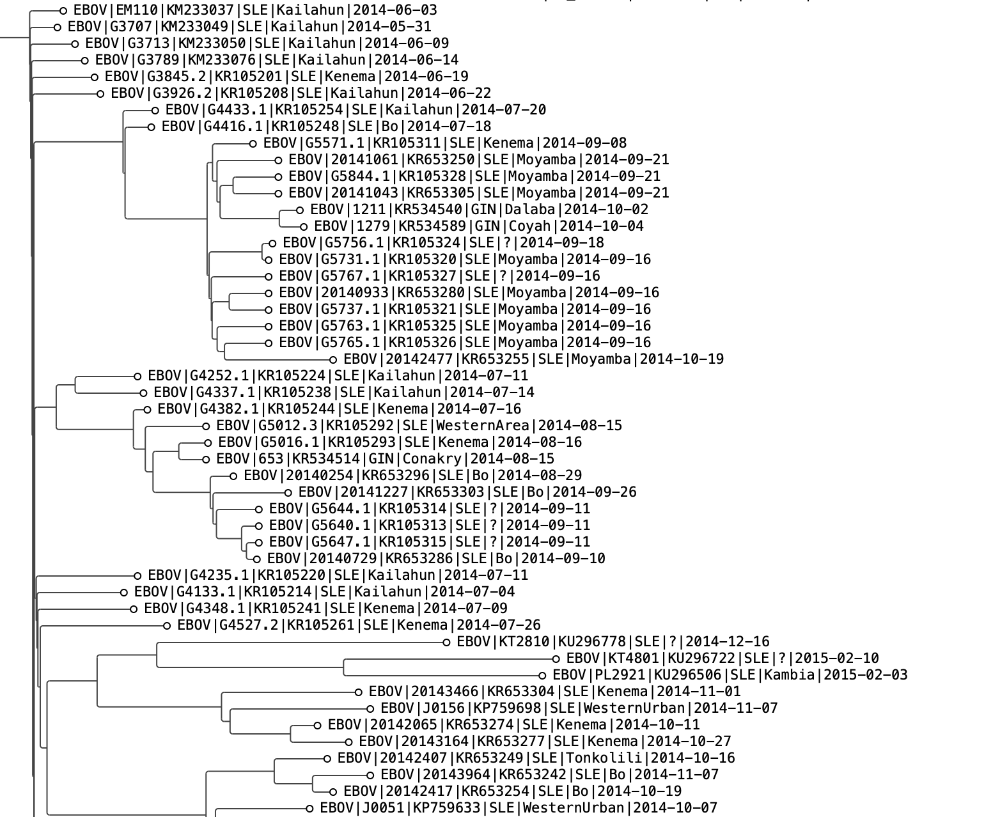
>
> EBOV tree zoomed in to show individual tip labels.

Press **⌘0** to return to the full view at any time.

### Subtree Navigation

**Double-click** any internal node to zoom into its subtree. The canvas re-renders showing only the descendants of that node, scaled to fill the full window.

Alternatively, select an internal node and click the drill-down button  or press **⌘⇧.**.

> 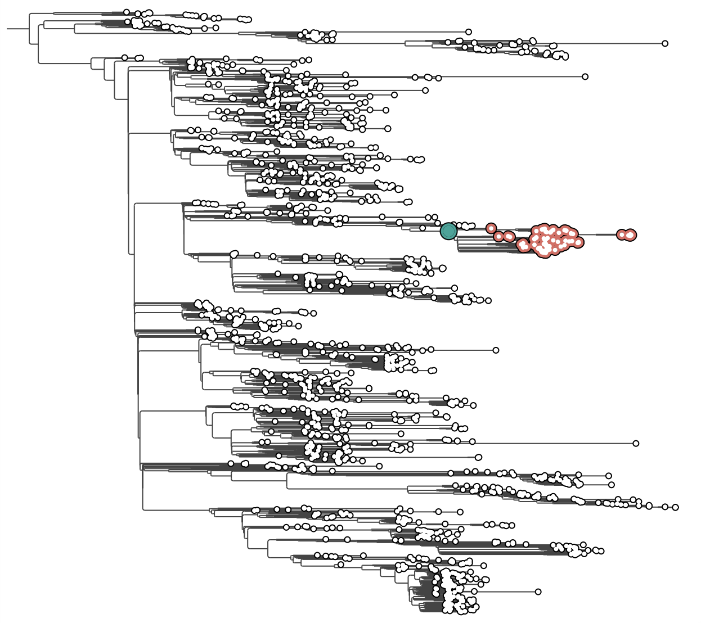
>
> 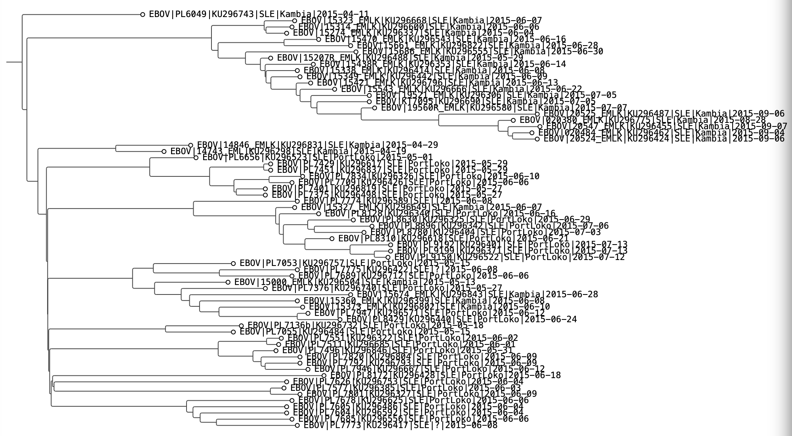
>
> A subclade before and after drilling down.

PearTree maintains a full navigation history:

| Button | Shortcut | Effect |
|---|---|---|
|  | **⌘[** | Go back to the previous view |
|  | **⌘]** | Go forward in history |
|  | **⌘⇧,** | Step up one level toward the root |
|  | **⌘\\** | Return to the full-tree root view |

> [!TIP]
> Navigate history like a web browser. Drill down into several different clades in sequence, then press **⌘[** to step back through each view. **⌘]** goes forward again. This makes it easy to compare distant parts of a large tree without re-navigating each time.

---

## Chapter 5: The Hyperbolic Lens

The hyperbolic lens expands a region of the tree to label-readable spacing without losing the surrounding context — the rest of the tree compresses but remains fully visible.

### Activating the Lens

Hold **~** (tilde/backtick) and move the cursor over the canvas. The tree distorts around the cursor's vertical position.

> 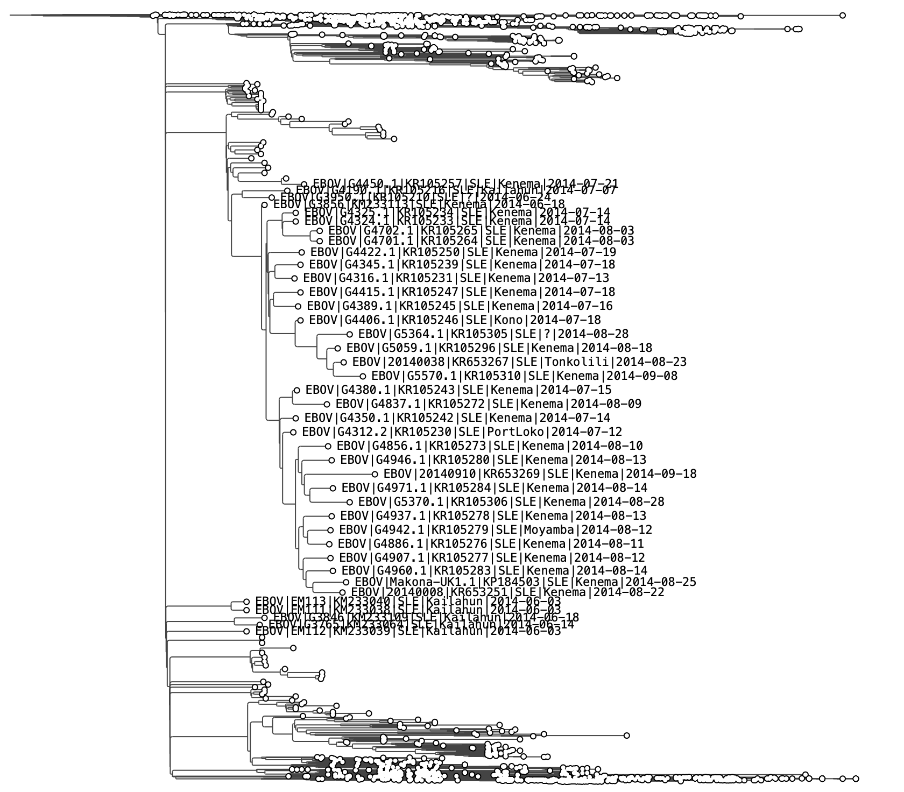
>
> Lens active: tips near the cursor are spread apart and readable; tips further away are compressed but still visible.

The lens **persists** after you release **~** — the focus locks in place so you can click, select, or inspect the expanded region normally. Re-hold **~** and move to reposition the focus. Press **Escape** to dismiss.

While the lens is active a reminder appears in the status bar: *Lens mode active – press Esc to cancel*.

### Adjusting the Lens Width

The **Lens** ⊕/⊖ buttons in the toolbar (or **⌘⇧=** / **⌘⇧−**) control how many tip rows wide the uniformly-expanded flat centre zone is:

- **⊕** — add one row of spacing to the flat zone
- **⊖** — remove one row
- At zero (default) the lens is a pure hyperbolic falloff from the focus point

Peak magnification caps at the *Fit Labels* spacing level, so labels in the expanded zone never overlap.

> [!TIP]
> The hyperbolic lens is ideal for large trees where fully zooming in would hide the context. Hold **~**, move to the region of interest, release to lock the focus, then interact with the expanded section. Press **Escape** when done.

---

## Chapter 6: Organising the Tree

### Branch Ordering

The **Order** buttons sort all clades by descendant count, giving a ladder-like layout:

| Button | Shortcut | Effect |
|---|---|---|
|  | **⌘U** | Larger clades toward the top |
|  | **⌘D** | Larger clades toward the bottom |

> 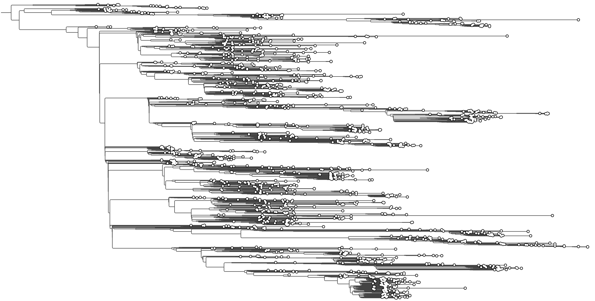
>
> EBOV tree with ascending (larger clades upward) order applied.

> [!NOTE]
> Once ordered, the original clade order is lost. You can switch between ascending and descending ordering, or rotate individual nodes manually (see below). Hiding a node (see below) also clears the branch ordering since the tip counts have changed.

### Rotating Nodes

'Rotating' swaps the order of a node's direct children (or recursively all children in a clade). This is a purely cosmetic change — the topology and branch lengths are unchanged.

Select an internal node, then use the Rotate buttons:

| Button | Effect |
|---|---|
|  | Reverse the direct children of the selected node only |
|  | Recursively reverse children at every level within the selected subtree |

> 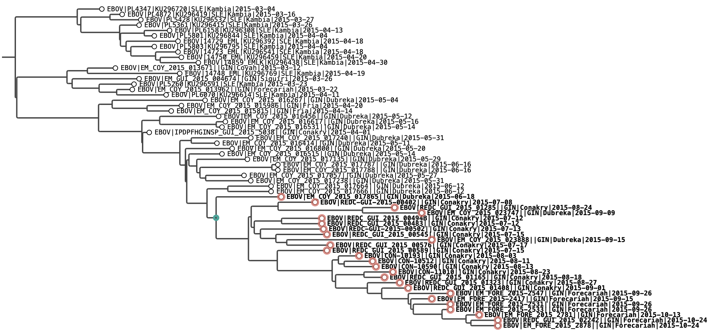
>
> 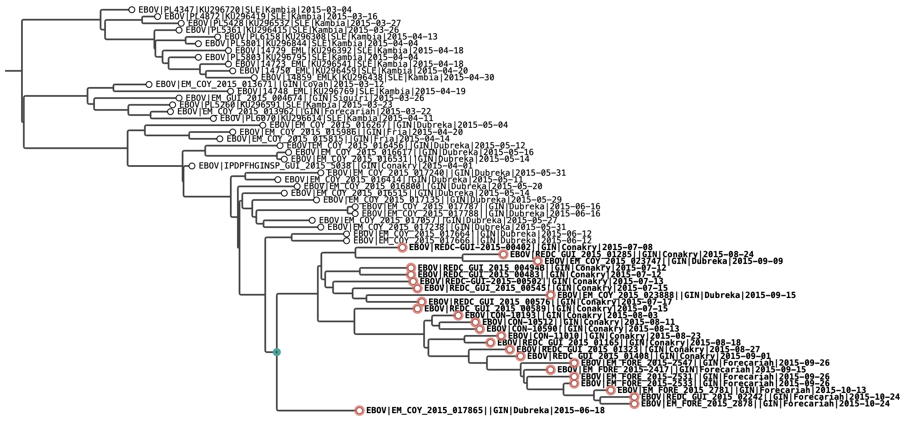
>
> 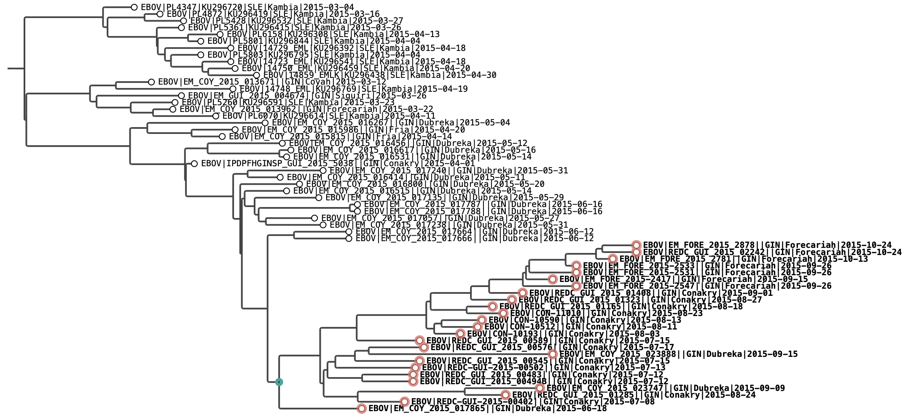
>
> Before and after rotating a single node (middle), and after rotating the entire clade (bottom).

### Hiding Nodes and Subtrees

Hiding removes a tip or entire subtree from the display without deleting it from the underlying tree. The remaining tree reflows to fill the space.

1. Select a tip or internal node.
2. Click the **Hide** button (eye-slash icon) in the toolbar.

> 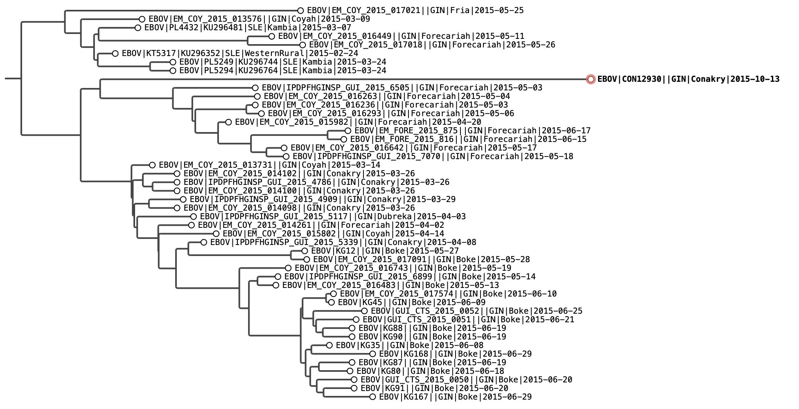
>
> 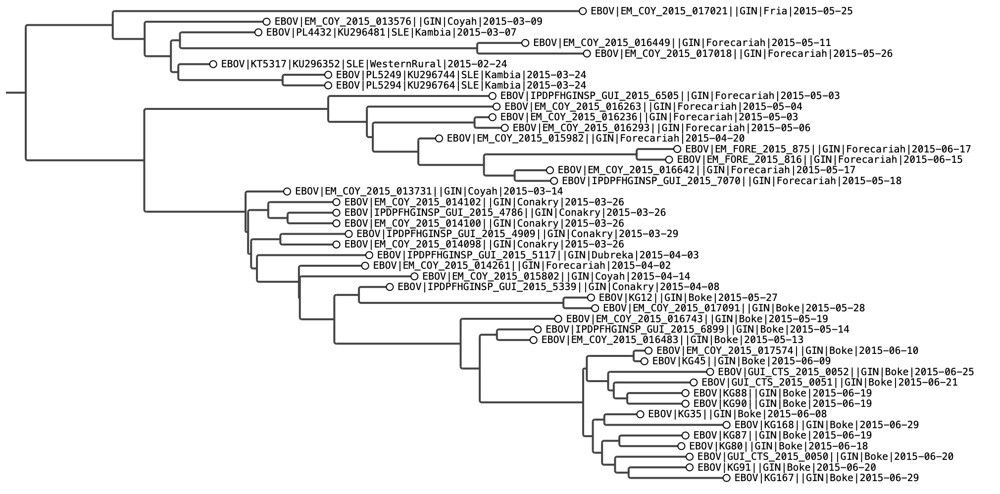
>
> A single tip before and after hiding.

> 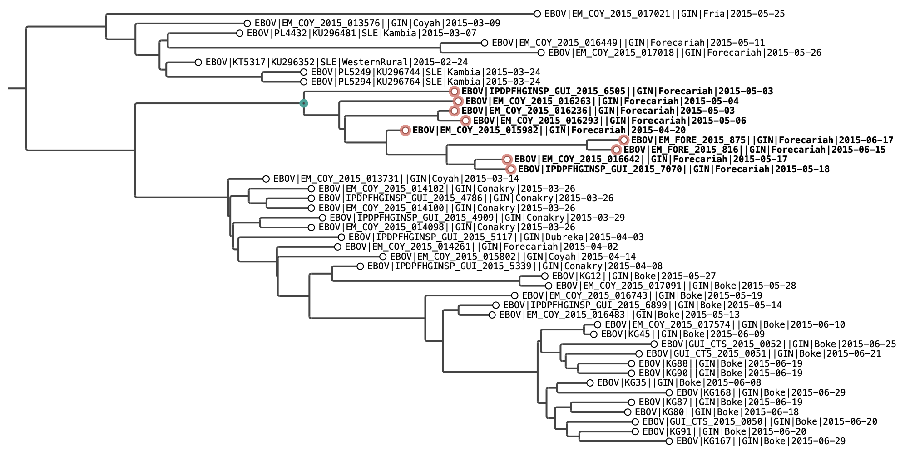
>
> 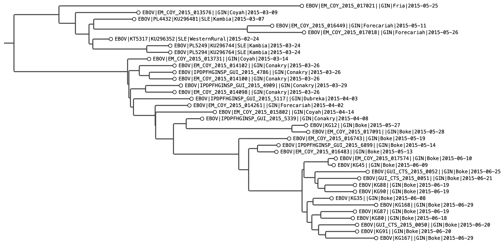
>
> A subtree selected (top) and after hiding all descendants (bottom).

**Showing hidden nodes:** when any hidden nodes exist in the current view, the **Unhide** button  becomes active.

- **With a node selected** — click Unhide to restore the hidden descendants of that node.
- **With nothing selected** — click Unhide to restore all hidden nodes at once.

> [!TIP]
> To isolate a subset of tips: type a keyword into the filter box to select all matching tips, press **⌘⇧I** to invert the selection, then click Hide. Everything except your subset disappears. Click Unhide (with nothing selected) when done.

### Collapsing Clades

Collapsing replaces a subtree with a filled triangle symbol. Unlike hiding, collapsed clades remain visible as a compact summary with a tip-count label.

1. Select an internal node.
2. Click the **Collapse** button in the toolbar.

The subtree becomes a filled triangle labelled with the clade name and enclosed tip count.

To expand: click the triangle to select it and click **Expand**, or **double-click the triangle** directly.

**Changing a triangle's colour:** with a triangle selected, use the colour picker in the toolbar to assign a custom fill colour. The eraser button resets to the theme default.

In the **Visual Options palette**, the **Collapsed Clades** section (visible once any clade has been collapsed) provides:

| Control | Effect |
|---|---|
| **Fill opacity** | Translucency of the triangle (0 = transparent, 1 = solid) |
| **Height (rows)** | Height of the triangle base in tip-row units (1–20) |

> [!TIP]
> Collapse the uninteresting parts of a large tree into triangles so the important regions fill the canvas with readable labels. Double-click any triangle to re-expand it when needed. Collapsed clades can also be individually coloured to categorise groups at a glance.

---

## Chapter 7: Selecting and Filtering

### Selection Modes

PearTree has two selection modes. The active mode is shown by which toolbar button is pressed.

**Nodes mode** (default)

- **Click a tip** — selects that tip; the status bar shows its name and divergence
- **Click an internal node** — selects all descendant tips; a teal MRCA ring marks the node
- **⌘-click** — add to or remove from the current selection
- **Click and drag** — drag-select all tips within a rectangular area
- **⌘A** — select all visible tips
- **⌘⇧I** — invert the selection
- **Click empty canvas** — clear the selection

> 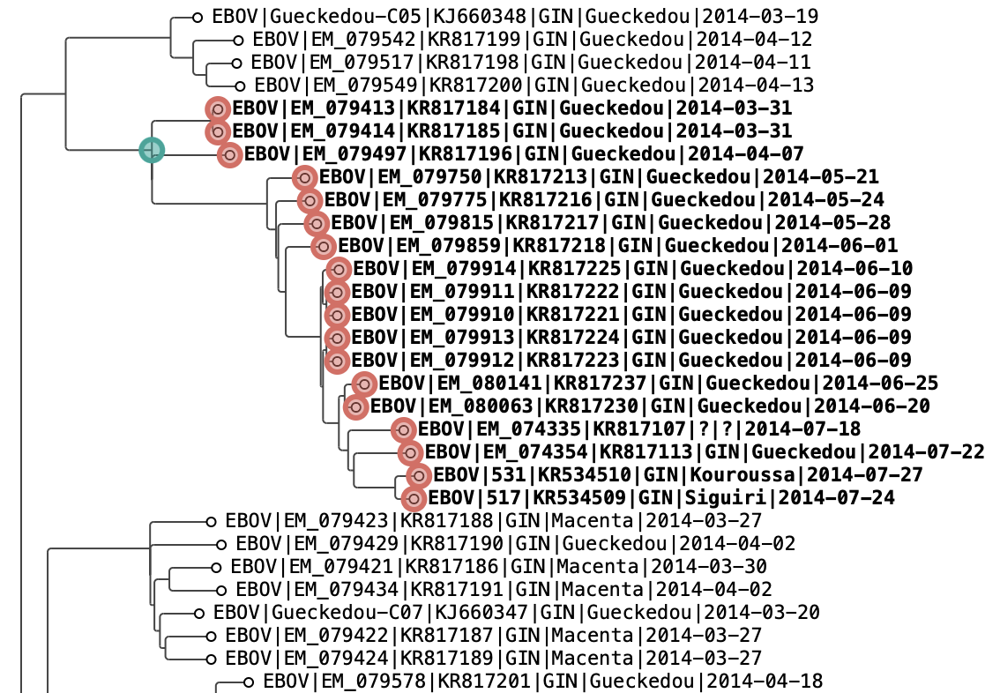
>
> A group of tips selected (highlighted) with MRCA ring visible on their most recent common ancestral node.

**Branches mode (⌘B)**

Press **⌘B** or click the branch-mode button to switch. Click anywhere along a horizontal branch to place a precise positional marker. This mode enables exact-position rerooting (see [Chapter 10](#chapter-10-rooting)).

> [!TIP]
> Branches mode is mainly used for precise rerooting. The example EBOV tree is an explicitly-rooted BEAST tree, so rerooting is disabled for it. Use `data/varv_rooted.nwk` or `data/large_tree.tree` to practise rerooting.

Press **⌘B** again to return to Nodes mode.

### Filtering Tips

The filter box in the toolbar instantly selects all visible tips whose labels contain the typed string.

> 

For example, type `SLE` to select all Sierra Leone EBOV tips:

> 

Press **Escape** or clear the box to remove the filter (the tip selection remains).

### Node Info

Select any node or tip, then press **⌘I** or click the  button. The Node Info dialog lists every annotation on that node — name, divergence, branch length, posterior support, date, and any imported custom fields.

> 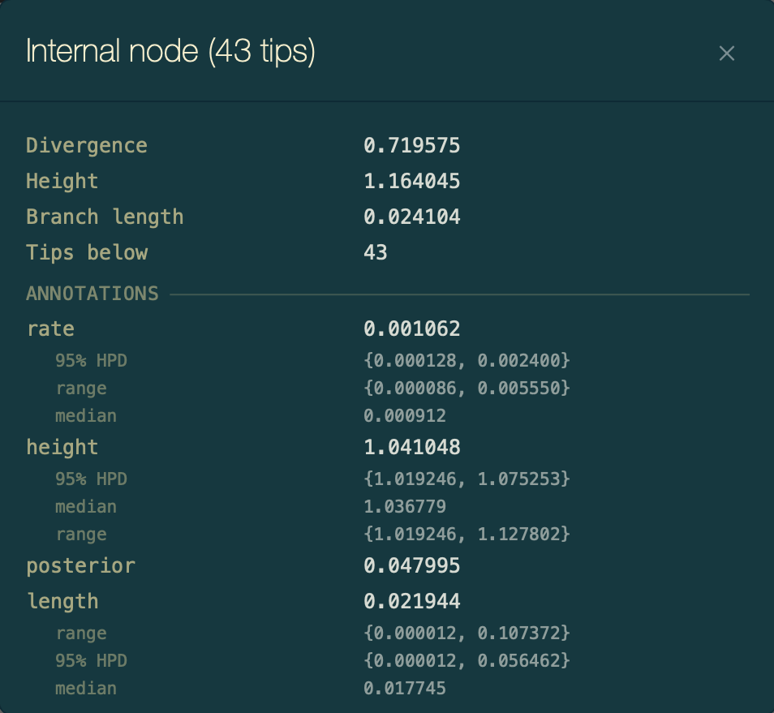
>
> Node Info dialog for a selected EBOV tip.

### Applying User Colours

1. Pick a colour using the colour swatch in the toolbar.
2. Select one or more tips.
3. Click the **Apply** button .

> 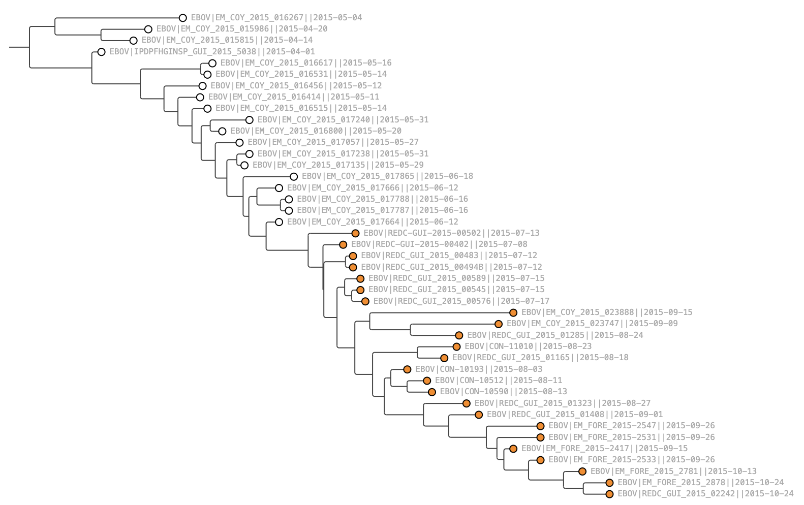
>
> Tips dated from July–September 2015 highlighted in orange.

User colours are stored as a `user_colour` annotation and are available in all *Colour by* dropdowns. When a NEXUS file is exported they travel with it.

To remove: click the **Clear** button . With tips selected, clears only those tips; with nothing selected, clears all user colours in the current view.

> [!TIP]
> Click a colour swatch in a categorical legend to instantly select all tips with that annotation value, wherever they appear in the tree. **⌘-click** additional swatches to add them to the selection. Then apply a user colour, hide, or export that group.

---

## Chapter 8: Decorating the Tree

All visual controls live in the **Visual Options palette**. Open it with the sliders button in the status bar or press **Tab**. Controls are organised into collapsible sections.

*This chapter uses the EBOV example tree with the `ebov.csv` annotations imported (see [Chapter 3](#chapter-3-importing-annotations)).*

### Themes

The **Theme** section at the top of the palette provides pre-built visual presets.

> 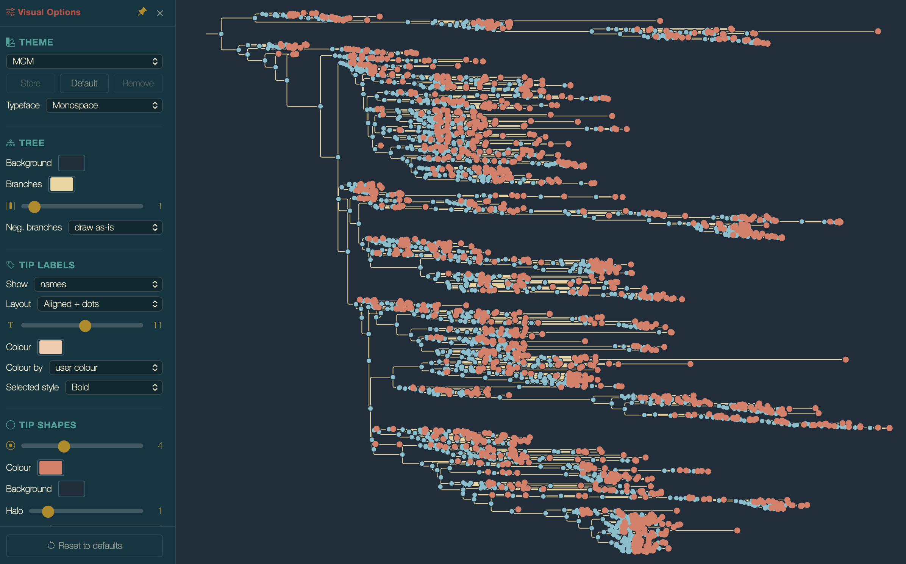
>
> The Theme section with the *MCM* theme applied.

| Control | Effect |
|---|---|
| Theme selector | Switch to a built-in or user-saved theme |
| **Store** | Save the current settings as a named personal theme |
| **Default** | Make this theme the starting point for new windows |
| **Remove** | Delete a user-saved theme |

Changing any individual setting switches the selector to *Custom*. Click **Reset to defaults** at the bottom of the palette to revert to the Artic theme.

### Tree Appearance

The **Tree** section controls the canvas background, branch colour and width, and the typeface used for all labels.

> 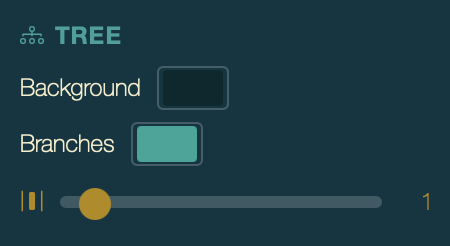

| Control | Effect |
|---|---|
| Background | Canvas fill colour |
| Branches | Branch line colour |
| Branch width | Stroke thickness (0.5–8 px) |
| Typeface | Font family for all labels |
| Neg. branches | *Draw* (as-is) or *Clamp to zero* |

> 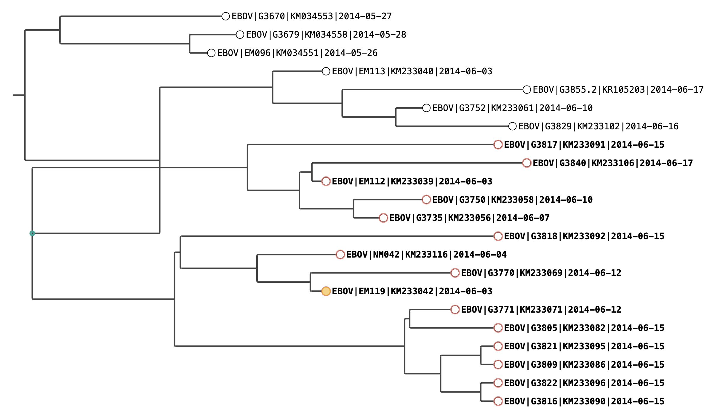 &nbsp; 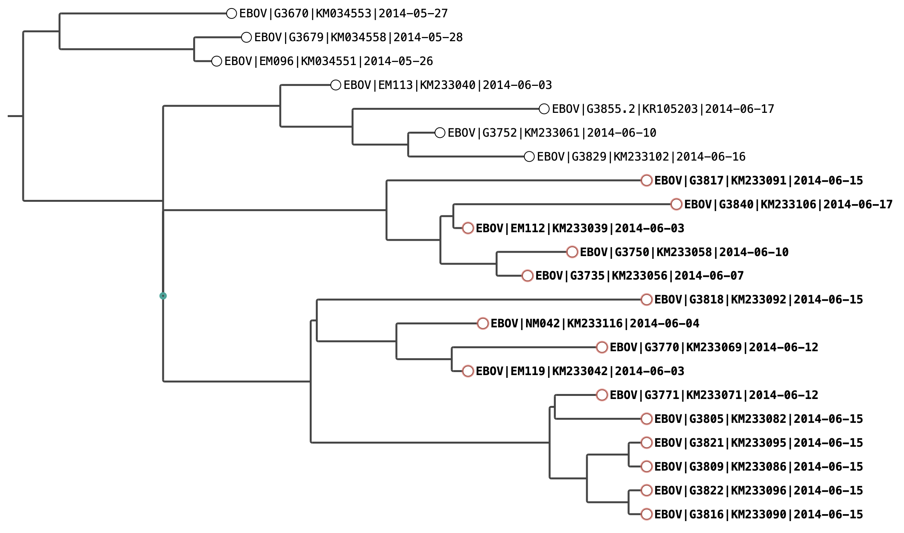
>
> Negative branch drawn as-is (left) vs. clamped to zero (right).

### Tip Labels

> 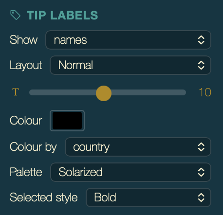

| Control | Effect |
|---|---|
| Show | *Off* — hide all labels; *Names* — show tip name; or select an annotation key to display its values instead |
| Layout | *Normal* (labels float at each tip) or aligned options (*Aligned*, *Dashed*, *Dots*, *Solid*) — labels line up at the rightmost tip with optional connector lines |
| Size | Font size (1–20 pt) |
| Colour | Default label colour |
| Colour by | Use an annotation key for per-tip label colour |
| Palette | Colour scheme when *Colour by* is active |
| Spacing | Gap between the tip marker and the label text (px) |

### Label Shapes

Coloured shapes can be drawn to the left of each tip label text, providing annotation colour swatches alongside each name.

| Control | Effect |
|---|---|
| Shape | *Off* / *Square* / *Circle* / *Block* |
| Size | Shape height as % of row height |
| Colour | Default fill colour |
| Colour by | Use an annotation key for shape colour |
| Margin left/right | Gap on each side of the shape (px) |

Multiple independent shape slots (up to 10) can be added to show several annotation dimensions simultaneously.

> **Screenshot placeholder** — EBOV tip labels with two shape slots: `country` squares and `location` circles, demonstrating dual-annotation labelling.

### Tip Shapes

> 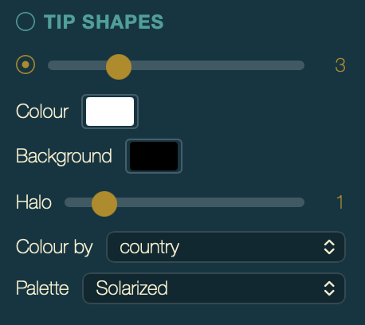

| Control | Effect |
|---|---|
| Size | Tip circle radius (0 = hidden) |
| Colour | Stroke/fill colour |
| Background | Halo fill colour |
| Halo | Halo ring radius (0 = hidden) |
| Colour by | Use an annotation key for tip colours |
| Palette | Colour scheme when *Colour by* is active |

Set **Colour by** to `country` to colour each tip by sampling country:

> 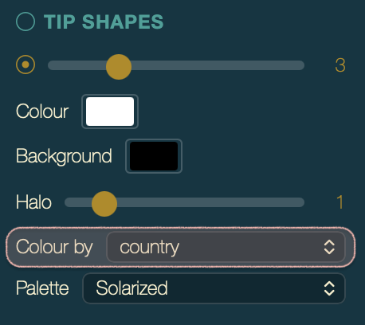
>
> Tip Shapes controls with **Colour by** set to `country`.

> 
>
> EBOV tips coloured by `country`.

### Node Shapes

> 

Internal nodes can show circles coloured by a node-level annotation — useful for displaying posterior support values.

| Control | Effect |
|---|---|
| Size | Node circle radius (0 = hidden) |
| Colour by | Use an annotation key (e.g. `posterior`) |
| Palette | For continuous support values, a diverging palette such as *Blue-Black-Red* works well: red = high support, blue = low |

> 
>
> Node Shapes controls with size set to 3 and **Colour by** set to `posterior`.

> 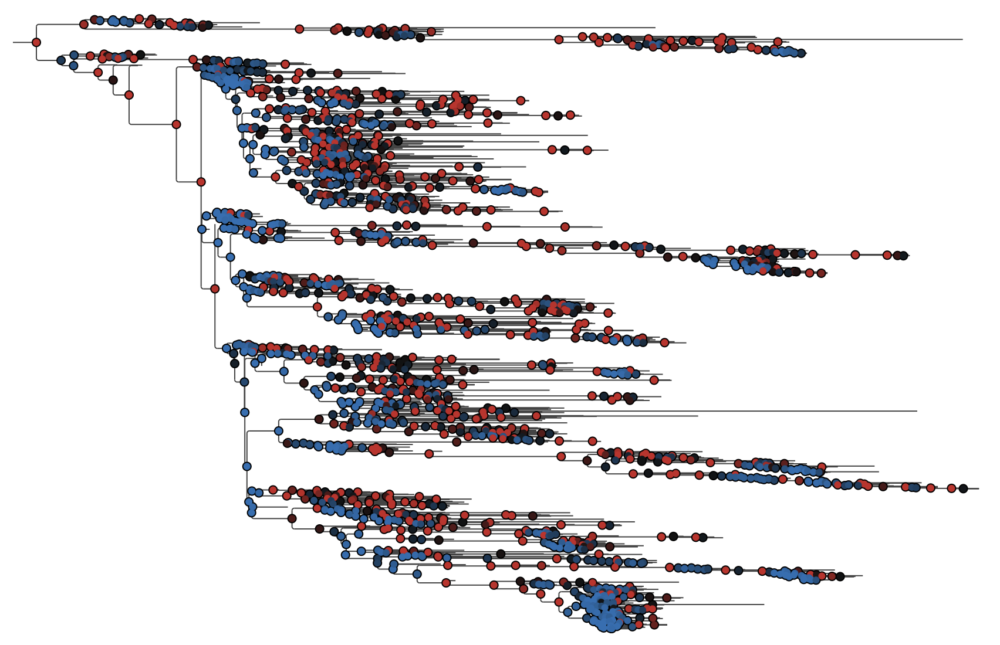
>
> EBOV tree with node shapes coloured by `posterior` support.

### Node Labels

Annotation values can be displayed as text labels on internal nodes — useful for bootstrap values, clade names, or any node-level string annotation.

| Control | Effect |
|---|---|
| Annotation | Which annotation key to display |
| Position | *Right*, *Above left*, or *Below left* |
| Font size | Label text size |
| Colour | Label text colour |
| Spacing | Gap between node and label text |

> **Screenshot placeholder** — EBOV tree with `posterior` node labels positioned to the right of each internal node.

### Node Bars

*Available for trees with node-height HPD annotations — illustrated using `data/measles_genome_tree.nexus`.*

When a BEAST tree carries HPD height annotations (e.g. `height_95%_HPD`), the **Node Bars** section appears in the palette:

| Control | Effect |
|---|---|
| Show | Toggle bars on/off |
| Colour | Bar colour |
| Bar height | Vertical thickness of each bar (px) |
| Line | Show a line at the node *Mean*, *Median*, or neither |
| Range whiskers | Show or hide the outer extent whiskers |

> **Screenshot placeholder** — Measles genome tree (`data/measles_genome_tree.nexus`) with node bars showing 95% HPD height intervals.

### Legends

Legends provide a colour key for any annotation used to colour tips, nodes, or labels. PearTree supports up to four independent legend strips simultaneously, all docked to the right side of the canvas.

In the **Legend** section of the palette:

1. Set **Annotation** to an annotation key (e.g. `country`).
2. Adjust **Height %**, **Colour**, and **Font size** as desired.

For categorical annotations a swatch-and-label key is drawn. For continuous numeric annotations a colour ramp with min/max labels is shown.

> 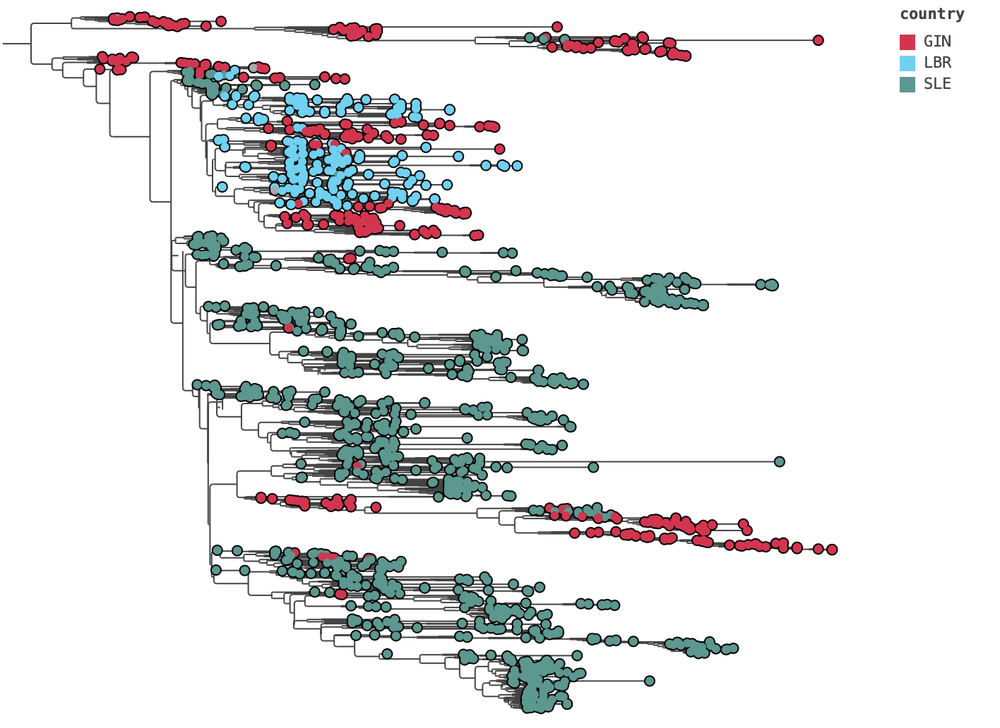
>
> EBOV tree with `country` legend docked to the right.

**Legend 2–4:** additional legends can be configured below Legend 1. Set each legend's **Position** to *Right* (shown in the same panel as Legend 1) or *Below* (stacked vertically).

Use **Height %** to control what fraction of the panel height each legend occupies.

> [!TIP]
> Use Legend 1 for a categorical annotation (e.g. country) and Legend 2 with **Position: Below** for a continuous annotation (e.g. posterior support) to display both keys simultaneously in a single neatly stacked column.

### Clade Highlights

Clade highlights draw a translucent coloured shape behind a selected subtree — useful for drawing attention to named clades in publication figures or for annotating groups visually.

**Adding a highlight:**
1. Select any internal node (its entire descendant clade is highlighted).
2. Click the **Highlight** button  (highlighter icon) in the toolbar.

A translucent shape appears behind all descendants of that node. Multiple independent highlights can be active simultaneously — each is stored separately and can have its own colour.

**Removing a highlight:** select the highlighted node again and click the Highlight button a second time to toggle it off.

**Highlight colour:** by default each highlight uses the *Colour by* mapping set in the Clade Highlights section of the palette. Set **Colour by** to *User colour* to use the toolbar colour picker, or to any annotation key to automatically colour each highlight by the value of that annotation at the clade root.

In the **Clade Highlights** section of the palette:

| Control | Effect |
|---|---|
| **Colour by** | *User colour* (toolbar swatch) or any annotation key |
| **Palette** | Colour scheme when *Colour by* is an annotation key |
| **Left edge** | *Rectangle* — straight vertical left edge at the clade-root node; *Outline subtree* — the shape hugs the left profile of every branch in the clade |
| **Right edge** | *At tip* — ends just past the clade's rightmost tip circle; *At label left* — aligns with the global label column; *At label right* — extends to the right canvas edge; *Outline tips* — the right edge steps individually around each tip, creating a staircase silhouette |
| **Padding** | Gap between the clade extent and the highlight border (px) |
| **Corners** | Corner-rounding radius (px) |
| **Opacity** | Translucency of the fill (0 = transparent, 1 = solid) |
| **Stroke** | Opacity of the border line |
| **Width** | Border line thickness (px) |

> [!TIP]
> The *Outline subtree* left edge combined with *Outline tips* right edge creates a tight polygon that traces the exact profile of the clade — useful for complex, non-rectangular subtrees. Collapsed clades inside the highlight are treated correctly: the shape extends to the full tip of the triangle.

---

## Chapter 9: The Time Axis

The axis adds a scale bar along the bottom of the canvas. Load the EBOV example tree to follow along — it carries a `date` annotation on each tip.

In the **Axis** section of the palette, set **Show** to one of four modes:

| Mode | Axis type |
|---|---|
| **Off** | No axis |
| **Forward** | Divergence from root (0 at root, increases toward tips) |
| **Reverse** | Distance from the most-divergent tip toward the root |
| **Time** | Calendar-date axis (requires a date calibration — see below) |

### Divergence Axes

Select **Forward** or **Reverse** to draw a plain numeric scale immediately — no calibration needed. Use these when branch lengths represent substitutions-per-site or similar units.

### Time-Calibrated Axis

#### Step 1 — Calibrate

In the **Tree** section of the palette (above the Axis section), a **Calibrate** dropdown appears when the loaded tree has at least one annotation that PearTree recognises as a date type. Select that annotation key (e.g. `date` or `collection_date`).

Once selected, a **Format** row appears:

| Format code | Example output |
|---|---|
| `yyyy-MM-dd` | `2014-09-12` |
| `yyyy-MMM-dd` | `2014-Sep-12` |
| `dd MMM yyyy` | `12 Sep 2014` |
| `dd MMMM yyyy` | `12 September 2014` |
| `MMM dd, yyyy` | `Sep 12, 2014` |
| `MMMM dd, yyyy` | `September 12, 2014` |

#### Step 2 — Set the axis to Time

In **Axis → Show**, select `Time`. The axis now displays calendar dates derived from the calibration.

#### Step 3 — Configure tick intervals

| Control | Options | Notes |
|---|---|---|
| **Major ticks** | Auto / Decades / Years / Quarters / Months / Weeks / Days | *Auto* gives ~5–8 ticks across the current view |
| **Minor ticks** | Off / (finer intervals) | Off by default |
| **Major labels** | Partial / Full / Component / Off | See below |
| **Minor labels** | Off / Component / Partial / Full | Off by default |

#### Label modes

| Mode | Year tick | Month tick | Day tick |
|---|---|---|---|
| **Partial** | `2014` | `2014-09` | `2014-09-12` |
| **Full** | (full chosen format) | (full chosen format) | (full chosen format) |
| **Component** | `2014` | `Sep` | `12` |
| **Off** | — | — | — |

For Weeks ticks: *Component* shows `W01`–`W53`; *Full* and *Partial* both show `2014-W37`.

> 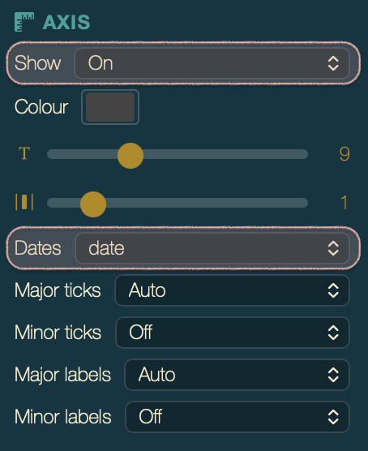
>
> EBOV tree with time axis. Major ticks = Years, labels = Partial.

---

## Chapter 10: Rooting

Rerooting is available for trees that are not explicitly rooted (e.g. raw IQ-TREE or RAxML output). For explicitly-rooted trees such as BEAST timed trees, rerooting is disabled.

*Use `data/varv_rooted.nwk` or `data/large_tree.tree` for the examples in this chapter.*

### Midpoint Root (⌘M)

Press **⌘M** or click **Midpoint** in the toolbar. The tree is rooted at the midpoint of the longest tip-to-tip path — a common exploratory starting point when no outgroup is available.

> **Screenshot placeholder** — `data/large_tree.tree` before and after midpoint rerooting, with root repositioned.

### Rerooting at a Selected Node

1. Select one or more tips (their MRCA defines the branch to root on).
2. Click the **Reroot** button in the toolbar.

The root is placed at the midpoint of the branch above the MRCA node.

### Rerooting at an Exact Branch Position

1. Press **⌘B** to enter **Branches** mode.
2. Click exactly where you want the new root along any branch.
3. Click **Reroot**.

> **Screenshot placeholder** — Branch position marker on `data/varv_rooted.nwk`, and the resulting tree after rerooting.

### Temporal Root

If your tree has tip dates, PearTree can find the root position that best linearises the root-to-tip regression (least-squares RTT regression).

Click **Temporal Root** in the toolbar or press **⌘⇧M**. Two modes are available:

| Mode | Description |
|---|---|
| **Local** (default) | Optimises root position only along the current root branch |
| **Global** | Searches every branch for the best regression fit |

> [!TIP]
> Use **Global** temporal root on a fresh unrooted tree to find the best root de novo. Use **Local** to fine-tune the position on a branch you have already identified as correct.

> **Screenshot placeholder** — RTT plot for `data/ebov.tree` before and after temporal rooting, showing improvement in the linear relationship.

### Bootstrap Values and Rerooting

When you reroot a tree, bootstrap support values (and other branch annotations) are correctly relocated to follow their branches. See [Appendix C](#appendix-c-bootstrap-values-branch-annotations-and-rerooting) for a full explanation of how this works.

---

## Chapter 11: The Root-to-Tip Panel

The Root-to-Tip (RTT) panel plots each tip's root-to-tip divergence against a tip-date annotation, with a linear regression overlay. It is the standard visual tool for assessing clock-like signal in a timed phylogeny and identifying outlier sequences.

*Load `data/ebov.tree` and import `data/ebov.csv` to follow along.*

Click the **RTT** button in the toolbar to open the panel.

> **Screenshot placeholder** — EBOV RTT panel showing a strong linear clock signal. Points are colour-coded by country.

### Panel Layout Modes

| Mode | Description |
|---|---|
| **Floating** | Panel overlays the right side of the canvas; close with × |
| **Fixed** | Panel is pinned open alongside the canvas at a configurable width; drag the resize handle to adjust |

Click the pin button in the panel header to toggle. In fixed mode the canvas and RTT panel share the full window width.

### Heterochronous Mode (scatter plot)

When tips carry sampling dates, the RTT panel shows a scatter plot:

- Each point is a visible tip; x = sampling date, y = root-to-tip divergence.
- The **regression line** shows the best-fit linear relationship.
- The **slope** (substitution rate) and **R²** (and additional statistics) are displayed in a moveable stats box in the plot corner.
- **Outliers** — tips that fall far from the regression line — may indicate sequencing errors, mislabelled dates, or recombination.

#### Residual band

Enable the **Band** control in the RTT section of the palette to overlay a shaded band around the regression line:

| Mode | Description |
|---|---|
| **±2σ residual** | Shaded band spanning ±2 standard deviations of the residuals — shows how spread the data is around the line |
| **95% CI** | 95% confidence interval for the mean — a much narrower band showing uncertainty in the regression line position itself |

The band colour, border style, and fill opacity are all independently configurable in the palette.

#### Drag-select

Click and drag on the plot to select all tips within the drawn rectangle. **Alt/Option-drag** draws a parallelogram aligned with the regression slope, making it easy to select tips at a particular residual range.

### Homochronous Mode (divergence histogram)

When tips have **no sampling dates** (a homochronous dataset), the RTT panel automatically switches to a divergence histogram.

> **Screenshot placeholder** — RTT histogram for a homochronous tree: bars show the distribution of tip root-to-tip divergences, individual tip dots are shown as a jitter strip above the bars.

- The x-axis is root-to-tip divergence; the y-axis is count.
- Each bar spans an equal-width divergence interval; the bar height is the number of tips in that bin.
- **Individual tip points** are drawn as a jitter strip in the headroom above the histogram bars. Each point represents one tip, positioned at its exact divergence value on the x-axis, with a small vertical jitter for readability.
- **Hovering or clicking** a tip point in the strip highlights the corresponding tip in the tree — the same selection and hover linkage as in the scatter plot.
- **Drag-select** a region in the strip to select all those tips in the tree.

#### Mean line and band

The same **Regression line** and **Band** controls in the palette apply to the histogram view:

- The **regression line** style settings draw a **vertical mean line** at the mean divergence.
- The **Band** control draws a vertical shaded rectangle:
  - **±2σ residual** — centred on the mean, spanning ±2 standard deviations of all divergence values.
  - **95% CI** — the 95% confidence interval for the mean divergence (much narrower than ±2σ).

### Interacting with the Plot

- **Click a point** — selects the corresponding tip in the tree and highlights its row in the data table.
- **Select a tip in the tree** — its point is highlighted in the RTT plot.
- **⌘-click** — add to or remove from the current selection.

### RTT Visual Options

In the **RTT** section of the Visual Options palette:

| Control | Effect |
|---|---|
| X-axis origin | *Data range* (axis starts at the earliest tip) or *Root age* (axis starts at the root age) |
| Aspect ratio | Fixed aspect ratio for the plot area, or *fit panel* to fill the available space |
| Grid lines | Show horizontal, vertical, both, or no grid lines |
| **Reg. line** | Style: *Solid*, *Big dash*, *Dash*, or *Dots* |
| **Reg. colour** | Regression / mean line colour |
| **Reg. width** | Regression / mean line thickness (px) |
| **Band** | *Off* / *±2σ residual* / *95% CI* — applies to both scatter and histogram modes |
| Band style | Border style: *Solid*, *Big dash*, *Dash*, or *Dots* |
| Band colour | Border line colour |
| Band width | Border line thickness (px) |
| Band fill | Fill colour |
| Band fill opacity | Fill translucency (0 = invisible, 1 = solid) |
| Box bg / text | Statistics box background and text colours |
| Axis colour | Plot axis, tick, and label colour |
| Axis font | Tick-label font size |
| Axis line | Axis stroke thickness |
| Typeface / Style | Font family and style for axis labels |
| Format | Date format for time-calibrated x-axis |
| Major / minor ticks | Interval and label configuration (same options as the main time axis; shown only in heterochronous mode) |

> [!TIP]
> Select outlier tips in the RTT scatter plot (click their points or drag-select a region), then click **Hide** in the main toolbar to remove them from the tree. This is the fastest way to clean a dataset for clock analysis.

---

## Chapter 12: The Data Table Panel

The Data Table panel lists all visible tips in tree order, with one column per annotation. Open it with the table button in the toolbar.

> **Screenshot placeholder** — Data Table panel pinned alongside the EBOV tree, showing tip names and imported annotation columns.

### Panel Layout Modes

Like the RTT panel, the Data Table can be floating or pinned fixed. Click the pin button in the panel header to toggle. Drag the resize handle (the border between tree and table) to adjust the width.

### Synchronisation with the Canvas

The Data Table is fully synchronised with the tree in both directions:

- Selecting a tip or node in the tree highlights the corresponding row(s).
- Clicking any row selects that tip in the tree and scrolls the canvas to its position.
- Collapsing, hiding, or filtering tree nodes updates the table instantly.

### Collapsed Clades in the Table

Collapsed clades appear as either one row per enclosed tip or a single placeholder row, allowing you to browse and select tips within a collapsed clade without expanding it.

### Restricting Columns

By default all annotation columns are shown. Rename keys in the Annotation Curator for cleaner column headers. When using the [embed API](embedded-api.md), pass `dataTableColumns` to show only specific columns in a fixed order.

> [!TIP]
> The Data Table is the fastest way to find a specific tip by name in a large tree. Open the panel, scan the sorted list or use your browser's in-page find (Ctrl/Cmd+F), click the row — the canvas scrolls and selects the tip automatically.

---

## Chapter 13: Exporting

### Exporting the Tree File

Click the **export tree** button (or press **⌘S**) to save the tree.

> 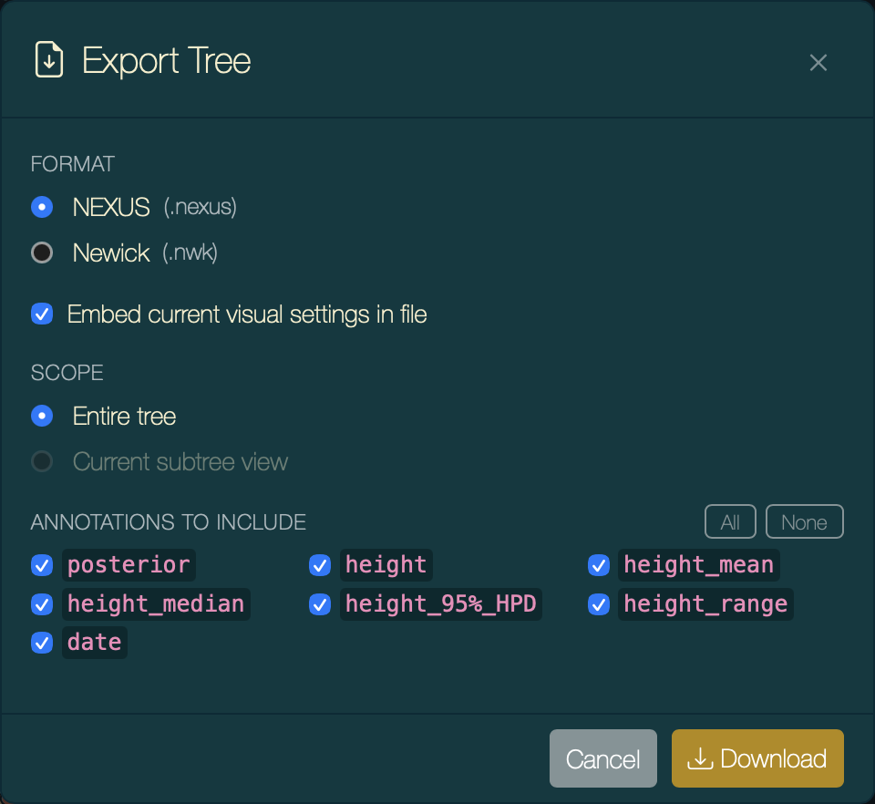
>
> Export Tree dialog.

| Option | Values | Notes |
|---|---|---|
| **Format** | NEXUS / Newick | NEXUS supports annotations and embedded settings; Newick is the most portable format |
| **Scope** | Entire tree / Current subtree view | Exports only the nodes currently on screen when *Current subtree view* is chosen |
| **Annotations** | Checkboxes per annotation key | Deselect any keys you do not want to include |
| **Embed settings** | Checkbox (NEXUS only) | Writes all current visual settings into the file |

> [!TIP]
> Always tick **Embed settings** when exporting NEXUS files for sharing or archival. The recipient's PearTree will automatically restore the full appearance — colours, legends, axis, theme — when they open the file.

### Exporting a Graphic

Click the **export graphic** button (or press **⌘⇧E**) to download an image.

> 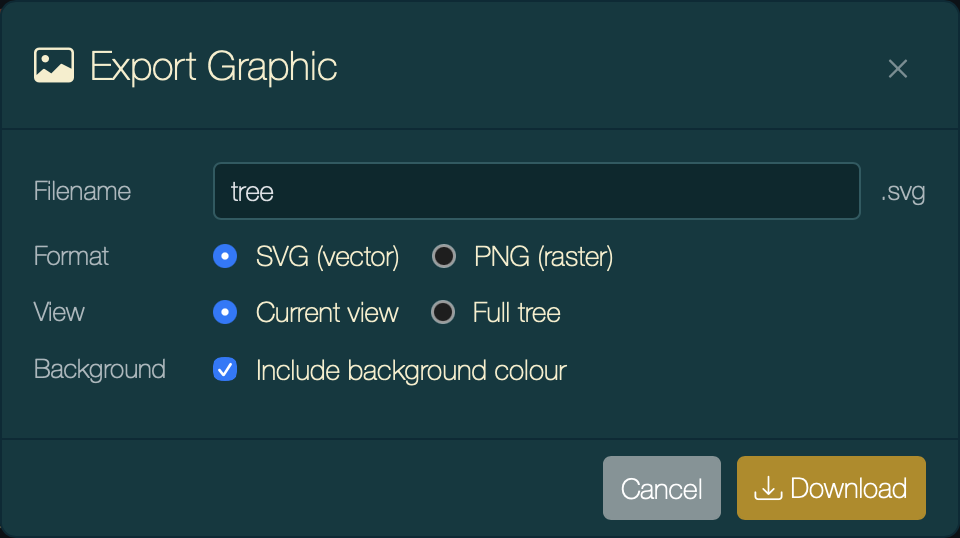
>
> Export Graphic dialog.

| Option | Values | Notes |
|---|---|---|
| **Format** | SVG / PNG | SVG is vector and infinitely scalable; PNG is raster at 2× screen resolution |
| **View** | Current view / Full tree | *Full tree* exports the complete vertical extent of the tree, not just the visible viewport |
| **Transparent background** | Checkbox | Omits the background fill (useful for compositing over a coloured page) |

SVG exports include branches, labels, shapes, legend strips, and the axis as true vector elements — ideal for publication figures.

---

## Chapter 14: Settings and Persistence

### Automatic Saving

PearTree automatically saves all visual settings to browser **localStorage** (web app) or a local settings file (desktop app). Settings are restored on the next visit or launch, including theme, palette values, colour-by choices, legend and axis configuration, and branch order.

### Resetting to Defaults

Click **Reset to defaults** at the bottom of the Visual Options palette to restore the Artic theme and all factory default values.

### Embedding Settings in a NEXUS File

Export a NEXUS file with **Embed settings** ticked (see [Chapter 13](#chapter-13-exporting)) to bundle all current visual settings with the tree data. Opening that file in PearTree on any machine restores the full appearance, making this the recommended way to share a tree with its visual configuration.

### Opening a File from the Command Line (Desktop App)

On macOS you can open a tree file directly in PearTree from Terminal:

```bash
open -a PearTree /path/to/my.nwk
```

If PearTree is already running, the file opens in a new window. On Windows, drag the file onto the PearTree icon in the taskbar, or use **Open With** from the Explorer context menu.

---

## Appendix A: Keyboard Shortcuts

> On Windows and Linux replace **⌘** with **Ctrl**.

| Shortcut | Action |
|---|---|
| **⌘O** | Open system file picker (desktop) or Open Tree dialog (web) |
| **⌘⇧O** | Open Tree dialog |
| **⌘⇧A** | Import annotations |
| **⌘S** | Export tree |
| **⌘⇧E** | Export graphic |
| **Tab** | Toggle Visual Options palette |
| **⌘=** / **⌘+** | Zoom in |
| **⌘−** | Zoom out |
| **⌘0** | Fit all |
| **⌘⇧0** | Fit labels |
| **⌘A** | Select all visible tips |
| **⌘⇧I** | Invert selection |
| **⌘B** | Toggle Nodes / Branches mode |
| **⌘D** | Order: larger clades toward bottom |
| **⌘U** | Order: larger clades toward top |
| **⌘M** | Midpoint root |
| **⌘⇧M** | Temporal root |
| **⌘I** | Node info |
| **⌘[** | Navigate back |
| **⌘]** | Navigate forward |
| **⌘\\** | Home (return to full tree view) |
| **⌘⇧,** | Climb up one level |
| **⌘⇧.** | Drill down into selected subtree |
| **⌘↑ / ⌘↓** | Scroll one page up / down |
| **⌘⇧↑ / ⌘⇧↓** | Jump to top / bottom of tree |
| **~** (hold) | Activate hyperbolic lens at cursor |
| **⌘⇧=** | Expand lens flat zone |
| **⌘⇧−** | Contract lens flat zone |
| **Escape** | Dismiss lens / close dialog / clear selection |

---

## Appendix B: Visual Options Reference

### Theme

| Control | Effect |
|---|---|
| Theme selector | Choose a built-in or personal preset |
| **Store** | Save the current settings as a named theme |
| **Default** | Set selected theme as the default for new windows |
| **Remove** | Delete a user-saved theme |

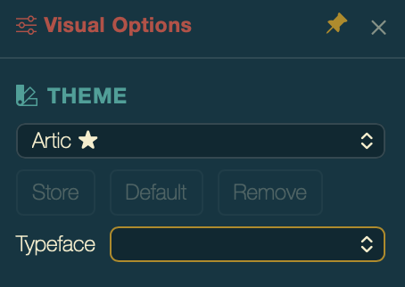

### Tree

| Control | Effect |
|---|---|
| Calibrate | Annotation key holding tip dates for time axis calibration |
| Format | Display format for calibrated axis labels |
| Background | Canvas background colour |
| Branches | Branch line colour |
| Branch width | Stroke thickness (0.5–8 px) |
| Typeface | Font family for all labels |
| Typeface style | Regular / Bold / Italic / Bold Italic |
| Neg. branches | *Draw* (as-is) or *Clamp to zero* |
| Elbow radius | Branch corner rounding (px) |
| Root stub | Length of the root stem line (px) |
| Root stem % | Root stem as % of total tree age (0–20) |
| Padding | Canvas margins: top, bottom, left, right (px) |


### Tip Labels

| Control | Effect |
|---|---|
| Show | *Off* / *Names* / annotation key |
| Layout | *Normal* / *Aligned* / *Dashed* / *Dots* / *Solid* |
| Size | Font size (1–20 pt) |
| Colour | Default label colour |
| Colour by | Annotation key for per-tip label colour |
| Palette | Colour scheme |
| Spacing | Gap after tip marker (px) |
| Selected style | *Normal* / *Bold* / *Italic* / *Bold Italic* for selected tips |


### Label Shapes

| Control | Effect |
|---|---|
| Shape | *Off* / *Square* / *Circle* / *Block* |
| Size | % of row height |
| Colour | Default fill |
| Colour by | Annotation key |
| Margin left/right | Gap on each side (px) |
| Spacing | Gap between multiple shape slots (px) |

### Tip Shapes

| Control | Effect |
|---|---|
| Size | Radius (0 = hidden) |
| Colour | Stroke/fill colour |
| Background | Halo fill colour |
| Halo | Halo ring radius |
| Colour by | Annotation key |
| Palette | Colour scheme |


### Node Shapes

| Control | Effect |
|---|---|
| Size | Radius (0 = hidden) |
| Colour | Default shape colour |
| Background | Halo fill |
| Colour by | Annotation key |
| Palette | Colour scheme |


### Node Labels

| Control | Effect |
|---|---|
| Annotation | Key to display as text on internal nodes |
| Position | *Right* / *Above left* / *Below left* |
| Font size | Text size (pt) |
| Colour | Text colour |
| Spacing | Gap between node and label (px) |

### Node Bars *(BEAST trees only)*

| Control | Effect |
|---|---|
| Show | On / Off |
| Colour | Bar colour |
| Bar height | Vertical thickness (px) |
| Line | *Mean* / *Median* / *Off* |
| Range whiskers | Show outer extent whiskers |

### Collapsed Clades

| Control | Effect |
|---|---|
| Fill opacity | 0 (transparent) – 1 (solid) |
| Height (rows) | Triangle base height in tip-row units |

### Clade Highlights

| Control | Effect |
|---|---|
| Colour by | *User colour* or any annotation key |
| Palette | Colour scheme when *Colour by* is an annotation |
| Scale | How the numeric colour scale range is mapped (auto / symmetric ±0 / from zero / 0→1) |
| Left edge | *Rectangle* — straight left edge at clade root; *Outline subtree* — hugs the branch profile |
| Right edge | *At tip* / *At label left* / *At label right* / *Outline tips* (staircase per tip) |
| Padding | Gap between clade extent and border (px) |
| Corners | Corner-rounding radius (px) |
| Opacity | Fill translucency |
| Stroke | Border opacity |
| Width | Border line thickness (px) |

### Legend

| Control | Effect |
|---|---|
| Annotation | Annotation key to show as a colour key |
| Colour | Legend text and label colour |
| Font size | Legend font size (pt) |
| Height % | Fraction of canvas height this legend occupies |


### Axis

| Control | Effect |
|---|---|
| Show | *Off* / *Forward* / *Reverse* / *Time* |
| Colour | Axis line and label colour |
| Font size | Tick-label font size |
| Line width | Axis stroke thickness |
| Major ticks | Auto / Decades / Years / Quarters / Months / Weeks / Days |
| Minor ticks | Off / (finer intervals) |
| Major labels | *Partial* / *Full* / *Component* / *Off* |
| Minor labels | *Off* / *Component* / *Partial* / *Full* |

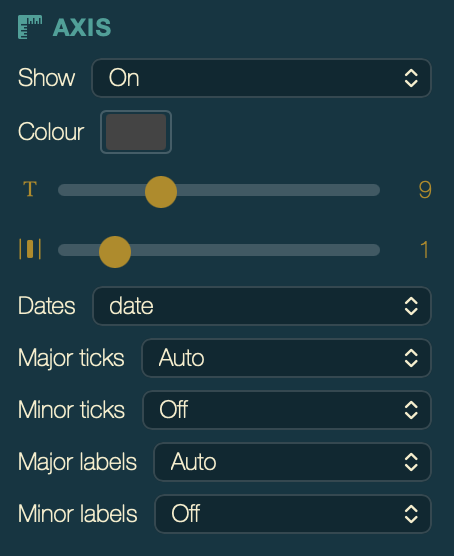

### RTT

| Control | Effect |
|---|---|
| X-axis origin | *Data range* or *Root age* |
| Aspect ratio | Fixed ratio or *fit panel* |
| Grid lines | *Both* / *Horizontal* / *Vertical* / *Off* |
| Reg. line | Regression / mean-line style: *Solid* / *Big dash* / *Dash* / *Dots* |
| Reg. colour | Regression / mean line colour |
| Reg. width | Line thickness (px) |
| Band | *Off* / *±2σ residual* / *95% CI* — shown in both scatter and histogram modes |
| Band style | Border style of band lines |
| Band colour | Band border colour |
| Band width | Band border thickness (px) |
| Band fill | Band fill colour |
| Band fill opacity | Band fill translucency |
| Box bg / text | Stats box background and text colours |
| Box font | Stats box font size |
| Axis colour | Axis line and label colour |
| Axis font | Tick-label font size |
| Axis line | Axis stroke thickness |
| Typeface / Style | Font family and style for axis labels |
| Format | Date format (heterochronous mode only) |
| Major / minor ticks | Tick intervals (heterochronous mode only) |
| Major / minor labels | Label format (heterochronous mode only) |

---

## Appendix C: Bootstrap Values, Branch Annotations, and Rerooting

### Node Annotations vs. Branch Annotations

Every internal node can carry two conceptually distinct kinds of data:

- **Node annotations** — properties of the *node itself* (e.g. Bayesian posterior probability, inferred node height in time). These belong to the node regardless of where the root sits.
- **Branch annotations** — properties of the *branch leading from the node to its parent* (e.g. bootstrap support). These belong to the branch, not the node, and must travel with it when the tree is rerooted.

### Bootstrap Values in Tree Files

Bootstrap support values are conventionally written as internal node labels in Newick format:

```
((A:0.1,B:0.1)95:0.01,(C:0.1,(D:0.1,E:0.1)72:0.2)80:0.3);
```

Here `95`, `72`, and `80` are bootstrap values. They are stored *at* the node in the file format, but they describe the *branch leading from that node to its parent*. PearTree automatically marks these well-known keys as branch annotations: `bootstrap`, `support`, `label`, `posterior`, `posterior_probability`, `prob`, `probability`.

For non-standard key names (e.g. `UFBoot` from IQ-TREE), open the **Annotation Curator** and tick **Branch annotation** manually.

### How Rerooting Moves Branch Annotations

When you reroot on a new branch, PearTree updates all branch annotation values along the path between old and new root:

- Each node on the path *receives* the value that was on the branch above it (toward the old root), because after rerooting that is the branch entering that node from its new parent.
- The node adjacent to the old root, whose branch is split to create the two new root branches, loses its value — there is no meaningful bootstrap for a newly created root edge.
- All nodes *not* on the path are unaffected.

Multiple sequential reroots are handled correctly. BEAST trees carry posterior as a **node** annotation (not a branch annotation), and rerooting is disabled for them in any case.

---

## Appendix D: URL Parameters and Sharing

When using the PearTree web application, you can construct a URL that pre-loads a tree and applies settings automatically.

### Basic Tree Link

```
https://peartree.live/?treeUrl=https://example.com/my.tree
```

The remote server must send `Access-Control-Allow-Origin: *`. GitHub raw file URLs work without any configuration:

```
https://peartree.live/?treeUrl=https://raw.githubusercontent.com/artic-network/peartree/main/data/ebov.tree
```

Anyone who follows the link sees the tree immediately — no download or upload required.

### Available Parameters

| Parameter | Description |
|---|---|
| `treeUrl` | URL of a remote Newick or NEXUS file to load on startup |
| `tree` | URL-encoded inline Newick or NEXUS string |
| `filename` | Filename hint for format detection (e.g. `my.nwk`) |

Settings embedded in a NEXUS file opened via `treeUrl` are applied automatically. A single URL can therefore deliver both the tree data and its complete visual configuration to any recipient with no setup required.
